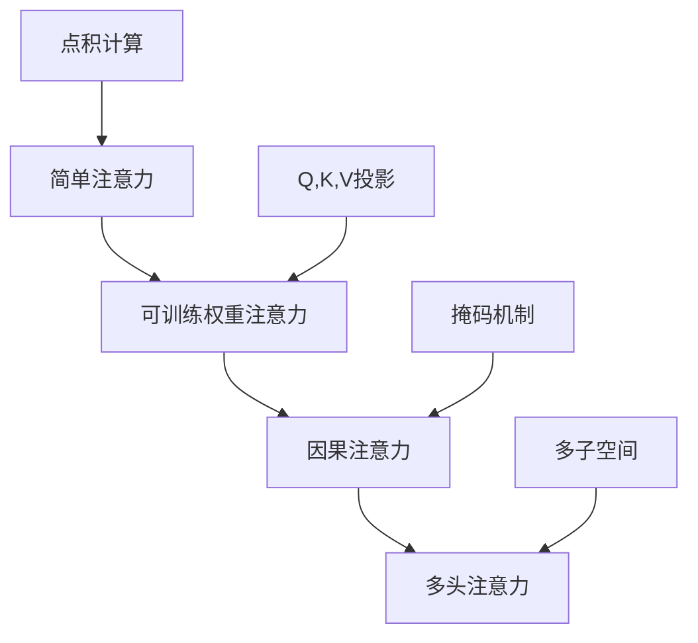

# LLMs从零实现 - 第三章：注意力机制完全指南

## 📚 目录
- [1. 简单注意力机制](#1-简单注意力机制)
- [2. 带可训练权重的自注意力](#2-带可训练权重的自注意力)
- [3. 因果注意力（Causal Attention）](#3-因果注意力causal-attention)
- [4. 多头注意力机制](#4-多头注意力机制)
- [5. 知识总结与对比](#5-知识总结与对比)

---

## 1. 简单注意力机制

### 1.1 什么是注意力机制？

**💡 核心概念：**
注意力机制模仿人类的注意力系统，让模型在处理序列数据时能够"关注"到重要的部分。

**类比理解：**
> 想象你在阅读一篇文章，你会自然地更关注某些关键词，而忽略一些无关紧要的词。注意力机制就是让计算机学会这种"选择性关注"的能力。

### 1.2 准备输入数据

```python
import torch

# 创建6个词的嵌入向量，每个词用3维向量表示
inputs = torch.tensor(
    [
        [0.43, 0.15, 0.89], # Your     - 第1个词
        [0.55, 0.87, 0.66], # journey  - 第2个词
        [0.57, 0.85, 0.64], # starts   - 第3个词
        [0.22, 0.58, 0.33], # with     - 第4个词
        [0.77, 0.25, 0.10], # one      - 第5个词
        [0.05, 0.80, 0.55]  # step     - 第6个词
    ]
)
```

**📊 数据结构：**
```
形状: (6, 3)
- 6行：6个单词
- 3列：每个词的3维嵌入向量
```

### 1.3 计算单个查询的注意力分数

```python
# 选择第二个词 "journey" 作为查询向量
query = inputs[1]  # [0.55, 0.87, 0.66]

# 创建一个空张量存储注意力分数
attn_scores_2 = torch.empty(inputs.shape[0])

# 计算查询向量与所有输入向量的点积
for i, x_i in enumerate(inputs):
    attn_scores_2[i] = torch.dot(x_i, query)

print(attn_scores_2)
```

**🔍 点积的含义：**
- 点积越大 → 两个向量越相似 → 注意力越高
- 点积越小 → 两个向量越不相关 → 注意力越低

**输出示例：**
```
tensor([0.9544, 1.4950, 1.4754, 0.8434, 0.7070, 1.0865])
```

### 1.4 归一化注意力权重

#### 方法1：简单归一化（不推荐）

```python
# 直接除以总和进行归一化
attn_weights_2_tmp = attn_scores_2 / attn_scores_2.sum()
print("Attention weights:", attn_weights_2_tmp)
print("Sum:", attn_weights_2_tmp.sum())
```

**❌ 问题：**
- 负值无法正确处理
- 不能突出重要信息

#### 方法2：使用Softmax函数（✅ 推荐）

```python
# 简单的softmax实现（仅用于教学）
def softmax_naive(x):
    return torch.exp(x) / torch.exp(x).sum(dim=0)

# PyTorch内置的softmax（数值稳定，推荐使用）
attn_weights_2 = torch.softmax(attn_scores_2, dim=0)
print("Attention weights:", attn_weights_2)
print("Sum:", attn_weights_2.sum())
```

**✨ Softmax的优势：**
1. 将所有值转换为正数（通过指数运算）
2. 保证所有权重的和为1（概率分布）
3. 放大差异，突出重要信息

**输出示例：**
```
Attention weights: tensor([0.1455, 0.2264, 0.2233, 0.1311, 0.1188, 0.1549])
Sum: tensor(1.0000)
```

### 1.5 计算上下文向量

```python
# 初始化上下文向量
query = inputs[1]
context_vec_2 = torch.zeros(query.shape)

# 加权求和：注意力权重 × 对应的输入向量
for i, x_i in enumerate(inputs):
    context_vec_2 += attn_weights_2[i] * x_i

print("Context vector:", context_vec_2)
```

**🎯 上下文向量的意义：**
- 融合了所有词的信息
- 但更重要的词（注意力权重高的）贡献更大
- 是"journey"这个词考虑了上下文后的新表示

### 1.6 批量计算所有注意力

#### 方式1：循环计算（慢）

```python
# 双重循环计算所有注意力分数
attn_scores = torch.empty(6, 6)
for i, x_i in enumerate(inputs):
    for j, x_j in enumerate(inputs):
        attn_scores[i, j] = torch.dot(x_i, x_j)

print(attn_scores)
```

#### 方式2：矩阵乘法（快 ✅）

```python
# 使用矩阵乘法一次性计算所有注意力分数
attn_scores = inputs @ inputs.T
print(attn_scores)
```

**⚡ 性能对比：**
- 循环：O(n²)次Python操作
- 矩阵乘法：GPU加速，速度快100倍以上

**输出：**
```
tensor([[0.9995, 0.9544, 0.9422, 0.4753, 0.4576, 0.6310],
        [0.9544, 1.4950, 1.4754, 0.8434, 0.7070, 1.0865],
        [0.9422, 1.4754, 1.4570, 0.8296, 0.7154, 1.0605],
        ...
```

### 1.7 计算所有上下文向量

```python
# 对每一行应用softmax，得到注意力权重
attn_weights = torch.softmax(attn_scores, dim=-1)
print(attn_weights)

# 验证每行的和是否为1
print("All row sums:", attn_weights.sum(dim=-1))

# 矩阵乘法计算所有上下文向量
all_context_vecs = attn_weights @ inputs
print("All context vectors:", all_context_vecs)
```

**📐 形状变化：**
```
inputs:          (6, 3)
attn_scores:     (6, 6)  ← inputs @ inputs.T
attn_weights:    (6, 6)  ← softmax(attn_scores)
context_vecs:    (6, 3)  ← attn_weights @ inputs
```

---

## 2. 带可训练权重的自注意力

### 2.1 为什么需要可训练权重？

**❌ 简单注意力的问题：**
- 直接使用原始输入计算注意力
- 没有学习能力，无法根据任务调整
- 表达能力有限

**✅ 可训练权重的优势：**
- 通过线性变换学习更好的表示
- Q、K、V三个不同的投影，捕捉不同信息
- 可以在训练中优化，适应具体任务

### 2.2 初始化参数

```python
import torch

# 输入数据（同上）
inputs = torch.tensor([
    [0.43, 0.15, 0.89], # Your
    [0.55, 0.87, 0.66], # journey
    [0.57, 0.85, 0.64], # starts
    [0.22, 0.58, 0.33], # with
    [0.77, 0.25, 0.10], # one
    [0.05, 0.80, 0.55]  # step
])

# 维度设置
x_2 = inputs[1]           # 第二个词 "journey"
d_in = inputs.shape[1]    # 输入维度 = 3
d_out = 2                 # 输出维度 = 2（降维）

# 设置随机种子（保证结果可复现）
torch.manual_seed(123)

# 创建三个可训练的权重矩阵
W_query = torch.nn.Parameter(torch.rand(d_in, d_out), requires_grad=False)  
W_key = torch.nn.Parameter(torch.rand(d_in, d_out), requires_grad=False)    
W_value = torch.nn.Parameter(torch.rand(d_in, d_out), requires_grad=False)  

print("W_query shape:", W_query.shape)  # (3, 2)
print("W_key shape:", W_key.shape)      # (3, 2)
print("W_value shape:", W_value.shape)  # (3, 2)
```

**🎯 三个权重矩阵的作用：**

| 矩阵 | 名称 | 作用 |
|------|------|------|
| W_query | 查询权重 | 将输入转换为"查询向量"，表示"我在找什么" |
| W_key | 键权重 | 将输入转换为"键向量"，表示"我有什么特征" |
| W_value | 值权重 | 将输入转换为"值向量"，包含"实际的信息内容" |

### 2.3 计算Q、K、V向量

#### 单个向量的变换

```python
# 对单个词 "journey" 进行线性变换
query_2 = x_2 @ W_query   # 形状: (2,)
keys_2 = x_2 @ W_key      # 形状: (2,)
values_2 = x_2 @ W_value  # 形状: (2,)
```

#### 整个序列的变换

```python
# 对所有词同时进行线性变换（矩阵乘法）
keys = inputs @ W_key      # 形状: (6, 2)
values = inputs @ W_value  # 形状: (6, 2)
queries = inputs @ W_query # 形状: (6, 2)

print("keys shape:", keys.shape)     # torch.Size([6, 2])
print("values shape:", values.shape) # torch.Size([6, 2])
```

**📊 可视化：**
```
输入 (6×3)    权重 (3×2)    输出 (6×2)
┌────────┐   ┌──────┐   ┌────────┐
│ 6个词  │ × │ W_Q  │ = │ 6个Q向量│
│ 3维    │   │ 3×2  │   │ 2维    │
└────────┘   └──────┘   └────────┘
```

### 2.4 计算注意力分数

```python
# 方法1：单个查询的注意力分数
keys_2 = keys[1]  # "journey" 的键向量
attn_score_22 = query_2.dot(keys_2)
print("自注意力分数:", attn_score_22)

# 方法2：一个查询对所有键的注意力分数
attn_scores_2 = query_2 @ keys.T
print("所有注意力分数:", attn_scores_2)  # 形状: (6,)
```

**🔍 物理意义：**
- `query_2`：表示"journey"在寻找什么
- `keys.T`：所有词的特征表示
- 点积：衡量匹配程度

### 2.5 缩放点积注意力（Scaled Dot-Product Attention）

```python
# 获取键向量的维度
d_k = keys.shape[-1]  # d_k = 2

# 缩放并应用softmax
attn_weights_2 = torch.softmax(
    attn_scores_2 / d_k ** 0.5,  # 除以sqrt(d_k)进行缩放
    dim=-1
)
print("注意力权重:", attn_weights_2)
```

**❓ 为什么要缩放？**

当维度d_k很大时：
- 点积的值会变得很大
- Softmax会进入饱和区（梯度接近0）
- 导致训练困难

**解决方案：**
```
缩放因子 = 1 / √d_k
```

**数学推导：**
```
假设 q 和 k 的元素均值为0，方差为1
则 q·k 的方差 = d_k
除以 √d_k 后，方差恢复为1
```

### 2.6 计算上下文向量

```python
# 加权求和得到最终的上下文向量
context_vec_2 = attn_weights_2 @ values
print("上下文向量:", context_vec_2)  # 形状: (2,)
```

**🎯 完整流程总结：**


### 2.7 SelfAttention_V1：简化版本

```python
import torch.nn as nn

class SelfAttention_V1(nn.Module):
    """简化的自注意力机制
    
    使用nn.Parameter直接定义权重矩阵
    """
    
    def __init__(self, d_in, d_out):
        super().__init__()
        # 使用Parameter定义可训练权重
        self.W_query = nn.Parameter(torch.rand(d_in, d_out))
        self.W_key = nn.Parameter(torch.rand(d_in, d_out))
        self.W_value = nn.Parameter(torch.rand(d_in, d_out))

    def forward(self, x):
        # 计算Q, K, V
        keys = x @ self.W_key
        queries = x @ self.W_query
        values = x @ self.W_value
        
        # 计算注意力分数
        attn_scores = queries @ keys.T
        
        # 缩放 + Softmax
        attn_weight = torch.softmax(
            attn_scores / (keys.shape[-1] ** 0.5), 
            dim=-1
        )
        
        # 加权求和
        context_vec = attn_weight @ values
        return context_vec

# 测试
torch.manual_seed(123)
sa_v1 = SelfAttention_V1(d_in, d_out)
result = sa_v1(inputs)
print("输出形状:", result.shape)  # (6, 2)
```

**⚠️ V1的局限性：**
- 使用`torch.rand`初始化，不够专业
- 不支持偏置项
- 不支持批处理

### 2.8 SelfAttention_V2：生产版本

```python
class SelfAttention_V2(nn.Module):
    """使用PyTorch Linear层的自注意力机制
    
    这是实际应用中推荐的实现方式
    """
    
    def __init__(self, d_in, d_out, qkv_bias=False):
        super().__init__()
        # 使用Linear层（自动初始化权重）
        self.W_query = nn.Linear(d_in, d_out, bias=qkv_bias)
        self.W_key = nn.Linear(d_in, d_out, bias=qkv_bias)
        self.W_value = nn.Linear(d_in, d_out, bias=qkv_bias)

    def forward(self, x):
        # 通过Linear层计算Q, K, V
        keys = self.W_key(x)
        queries = self.W_query(x)
        values = self.W_value(x)
        
        # 计算注意力分数
        attn_scores = queries @ keys.T
        
        # 缩放 + Softmax
        attn_weight = torch.softmax(
            attn_scores / (keys.shape[-1] ** 0.5), 
            dim=-1
        )
        
        # 加权求和
        context_vec = attn_weight @ values
        return context_vec

# 测试
torch.manual_seed(789)
sa_v2 = SelfAttention_V2(d_in, d_out)
print(sa_v2(inputs))
```

**✨ V2的优势：**
1. 使用`nn.Linear`，自动使用合适的初始化方法（Kaiming初始化）
2. 支持偏置项（可选）
3. 代码更简洁，符合PyTorch最佳实践

**📊 V1 vs V2 对比：**

| 特性 | V1 | V2 |
|------|----|----|
| 权重定义 | `nn.Parameter` | `nn.Linear` |
| 初始化 | 随机均匀分布 | Kaiming初始化 |
| 偏置支持 | ❌ | ✅ |
| 推荐使用 | 教学 | 生产环境 |

---

## 3. 因果注意力（Causal Attention）

### 3.1 什么是因果注意力？

**💡 核心概念：**
因果注意力（也叫掩码注意力）确保在预测第t个词时，只能看到前t-1个词，不能"偷看"未来的信息。

**🎯 应用场景：**
- GPT等自回归语言模型
- 文本生成任务
- 下一个词预测

**类比理解：**
> 就像你做阅读理解题，只能看到题目之前的内容，不能提前翻到后面的答案。

### 3.2 为什么需要因果掩码？

**问题场景：**
在标准自注意力中，每个词都可以看到所有其他词（包括未来的词）。

```
句子: "I love machine learning"

预测 "machine" 时：
- 标准注意力: 可以看到 "I", "love", "machine", "learning" ❌
- 因果注意力: 只能看到 "I", "love", "machine" ✅
```

**如果不使用因果掩码：**
- 模型会"作弊"，利用未来信息
- 训练时表现好，推理时表现差
- 无法用于文本生成

### 3.3 创建因果掩码

#### 方法1：下三角掩码

```python
import torch
import torch.nn as nn

# 假设序列长度为6
context_length = 6

# 创建全1矩阵
ones_matrix = torch.ones(context_length, context_length)
print("全1矩阵:\n", ones_matrix)

# 提取下三角部分（包括对角线）
mask_simple = torch.tril(ones_matrix)
print("下三角掩码:\n", mask_simple)
```

**输出：**
```
下三角掩码:
tensor([[1., 0., 0., 0., 0., 0.],
        [1., 1., 0., 0., 0., 0.],
        [1., 1., 1., 0., 0., 0.],
        [1., 1., 1., 1., 0., 0.],
        [1., 1., 1., 1., 1., 0.],
        [1., 1., 1., 1., 1., 1.]])
```

**含义：**
- `1`：可以看到（保留）
- `0`：不能看到（屏蔽）

#### 应用下三角掩码

```python
# 先计算标准的注意力权重
queries = sa_v2.W_query(inputs)
keys = sa_v2.W_key(inputs)
attn_scores = queries @ keys.T

attn_weights = torch.softmax(
    attn_scores / (keys.shape[-1] ** 0.5), 
    dim=-1
)

# 方法1：直接相乘
masked_weights = mask_simple * attn_weights
print("掩码后的权重:\n", masked_weights)

# 重新归一化（使每行和为1）
row_sums = masked_weights.sum(dim=-1, keepdim=True)
mask_simple_norm = masked_weights / row_sums
print("归一化后的权重:\n", mask_simple_norm)
```

**❌ 方法1的问题：**
- 需要先计算所有注意力权重
- 再乘以掩码
- 最后还要重新归一化
- 效率低，数值不稳定

#### 方法2：上三角掩码（✅ 推荐）

```python
# 创建上三角掩码（diagonal=1表示从主对角线上方开始）
mask = torch.triu(torch.ones(context_length, context_length), diagonal=1)
print("上三角掩码:\n", mask)
```

**输出：**
```
上三角掩码:
tensor([[0., 1., 1., 1., 1., 1.],
        [0., 0., 1., 1., 1., 1.],
        [0., 0., 0., 1., 1., 1.],
        [0., 0., 0., 0., 1., 1.],
        [0., 0., 0., 0., 0., 1.],
        [0., 0., 0., 0., 0., 0.]])
```

**含义：**
- `1`：需要屏蔽的位置（未来信息）
- `0`：保留的位置（当前及之前）

### 3.4 应用因果掩码（正确方法）

```python
# 将上三角位置填充为负无穷
masked_scores = attn_scores.masked_fill(mask.bool(), -torch.inf)
print("掩码后的注意力分数:\n", masked_scores)
```

**输出示例：**
```
tensor([[ 0.9995,   -inf,   -inf,   -inf,   -inf,   -inf],
        [ 0.9544,  1.4950,   -inf,   -inf,   -inf,   -inf],
        [ 0.9422,  1.4754,  1.4570,   -inf,   -inf,   -inf],
        ...
```

**🎯 为什么用负无穷？**

Softmax的性质：
```
exp(-∞) = 0
```

所以：
```
softmax([x1, x2, -∞, -∞]) = [p1, p2, 0, 0]
```

完美地将未来位置的权重设为0！

```python
# 应用softmax，得到最终的因果注意力权重
causal_attn_weights = torch.softmax(
    masked_scores / (keys.shape[-1] ** 0.5), 
    dim=-1
)
print("因果注意力权重:\n", causal_attn_weights)
```

**输出：**
```
tensor([[1.0000, 0.0000, 0.0000, 0.0000, 0.0000, 0.0000],
        [0.4120, 0.5880, 0.0000, 0.0000, 0.0000, 0.0000],
        [0.2135, 0.3925, 0.3940, 0.0000, 0.0000, 0.0000],
        ...
```

**✅ 验证：**
- 每行只有当前位置及之前有非零权重
- 每行的和仍然为1

### 3.5 Dropout正则化

```python
torch.manual_seed(123)
dropout = nn.Dropout(p=0.5)  # 50%的dropout率

# 对注意力权重应用dropout
dropped_weights = dropout(causal_attn_weights)
print("Dropout后的权重:\n", dropped_weights)
```

**💡 Dropout的作用：**
- 随机将一部分权重设为0
- 防止过拟合
- 提高模型泛化能力

**训练时：**
```
权重 × Dropout掩码 × (1 / (1-p))  # 缩放保持期望值不变
```

**推理时：**
```
不使用dropout，直接使用原始权重
```

### 3.6 批处理支持

```python
# 创建批处理数据（2个相同的样本）
batch = torch.stack((inputs, inputs), dim=0)
print("批处理形状:", batch.shape)  # (2, 6, 3)
```

**形状解释：**
- `2`：batch size（2个样本）
- `6`：sequence length（6个词）
- `3`：embedding dimension（3维嵌入）

### 3.7 CausalSelfAttention 完整实现

```python
class CausalSelfAttention(nn.Module):
    """因果自注意力机制
    
    确保在处理序列时只能访问当前位置及之前位置的信息
    """
    
    def __init__(self, d_in, d_out, context_length, dropout, qkv_bias=False):
        """
        参数:
        d_in: 输入维度
        d_out: 输出维度
        context_length: 最大序列长度
        dropout: dropout比率
        qkv_bias: 是否使用偏置
        """
        super().__init__()
        
        # Q, K, V的线性变换层
        self.W_query = nn.Linear(d_in, d_out, bias=qkv_bias)
        self.W_key = nn.Linear(d_in, d_out, bias=qkv_bias)
        self.W_value = nn.Linear(d_in, d_out, bias=qkv_bias)
        
        # Dropout层
        self.dropout = nn.Dropout(dropout)
        
        # 注册因果掩码缓冲区（不会被视为模型参数）
        self.register_buffer(
            "mask",
            torch.triu(torch.ones(context_length, context_length), diagonal=1)
        )

    def forward(self, x):
        """
        参数:
        x: 输入张量，形状 (batch_size, num_tokens, d_in)
        
        返回:
        context_vec: 上下文向量，形状 (batch_size, num_tokens, d_out)
        """
        b, num_tokens, d_in = x.shape
        
        # 计算Q, K, V
        keys = self.W_key(x)       # (b, num_tokens, d_out)
        queries = self.W_query(x)  # (b, num_tokens, d_out)
        values = self.W_value(x)   # (b, num_tokens, d_out)
        
        # 计算注意力分数
        # queries: (b, num_tokens, d_out)
        # keys.transpose(1, 2): (b, d_out, num_tokens)
        # 结果: (b, num_tokens, num_tokens)
        attn_scores = queries @ keys.transpose(1, 2)
        
        # 应用因果掩码
        # 只使用前num_tokens行和列（支持可变长度序列）
        attn_scores.masked_fill(
            self.mask.bool()[:num_tokens, :num_tokens],
            -torch.inf
        )
        
        # 缩放 + Softmax + Dropout
        attn_weights = self.dropout(
            torch.softmax(
                attn_scores / (keys.shape[-1] ** 0.5), 
                dim=-1
            )
        )
        
        # 加权求和
        # attn_weights: (b, num_tokens, num_tokens)
        # values: (b, num_tokens, d_out)
        # 结果: (b, num_tokens, d_out)
        context_vec = attn_weights @ values
        
        return context_vec

# 测试
torch.manual_seed(123)
context_length = batch.shape[1]  # 6
ca = CausalSelfAttention(d_in, d_out, context_length, dropout=0.0)
context_vecs = ca(batch)
print("输出形状:", context_vecs.shape)  # (2, 6, 2)
```

**🔑 关键改进：**
1. **批处理支持**：使用`transpose(1, 2)`而不是`.T`
2. **动态掩码**：`[:num_tokens, :num_tokens]`支持可变长度
3. **register_buffer**：掩码不会被优化器更新
4. **集成Dropout**：在Softmax后应用

**📊 形状追踪：**
```
输入 x:              (2, 6, 3)
                     ↓
keys/queries/values: (2, 6, 2)
                     ↓
attn_scores:         (2, 6, 6)  ← queries @ keys.transpose(1,2)
                     ↓
attn_weights:        (2, 6, 6)  ← softmax + dropout
                     ↓
context_vec:         (2, 6, 2)  ← attn_weights @ values
```

---

## 4. 多头注意力机制

### 4.1 为什么需要多头注意力？

**单头注意力的局限：**
- 只能学习一种注意力模式
- 可能错过不同类型的关系

**多头的优势：**
```
Head 1: 关注语法关系（主谓、动宾）
Head 2: 关注语义关系（同义词、反义词）
Head 3: 关注指代关系（代词指向）
Head 4: 关注位置关系（远近依赖）
...
```

**类比理解：**
> 就像多个专家同时分析一篇文章，每个专家从不同角度理解，最后综合所有人的意见。

### 4.2 方法1：封装多个单头注意力

```python
import torch
from torch import nn

# 复用之前定义的CausalAttention类
class CausalAttention(nn.Module):
    def __init__(self, d_in, d_out, context_length, dropout, qkv_bias=False):
        super().__init__()
        self.W_query = nn.Linear(d_in, d_out, bias=qkv_bias)
        self.W_key = nn.Linear(d_in, d_out, bias=qkv_bias)
        self.W_value = nn.Linear(d_in, d_out, bias=qkv_bias)
        self.dropout = nn.Dropout(dropout)
        
        self.register_buffer(
            "mask",
            torch.triu(torch.ones(context_length, context_length), diagonal=1)
        )

    def forward(self, x):
        b, num_tokens, d_in = x.shape
        
        keys = self.W_key(x)
        queries = self.W_query(x)
        values = self.W_value(x)
        
        attn_scores = queries @ keys.transpose(1, 2)
        
        attn_scores.masked_fill(
            self.mask.bool()[:num_tokens, :num_tokens],
            -torch.inf
        )
        
        attn_weights = self.dropout(torch.softmax(
            attn_scores / (keys.shape[-1] ** 0.5), 
            dim=-1
        ))
        
        context_vec = attn_weights @ values
        return context_vec
```

#### MultiHeadAttentionWrapper 实现

```python
class MultiHeadAttentionWrapper(nn.Module):
    """多头注意力包装器
    
    通过组合多个独立的因果注意力头来实现多头注意力
    """
    
    def __init__(self, d_in, d_out, context_length, dropout, num_heads, qkv_bias=False):
        """
        参数:
        d_in: 输入维度
        d_out: 每个头的输出维度
        context_length: 上下文长度
        dropout: dropout比率
        num_heads: 注意力头的数量
        qkv_bias: 是否使用偏置
        """
        super().__init__()
        
        # 创建多个独立的注意力头
        self.heads = nn.ModuleList([
            CausalAttention(d_in, d_out, context_length, dropout, qkv_bias)
            for _ in range(num_heads)
        ])

    def forward(self, x):
        """
        参数:
        x: 输入张量 (batch_size, num_tokens, d_in)
        
        返回:
        out: 输出张量 (batch_size, num_tokens, num_heads * d_out)
        """
        # 对每个头分别计算，然后在最后一个维度拼接
        return torch.cat([head(x) for head in self.heads], dim=-1)

# 测试
torch.manual_seed(123)
batch = torch.stack((inputs, inputs), dim=0)  # (2, 6, 3)
context_length = batch.shape[1]  # 6
d_in, d_out = 3, 2

mha_wrapper = MultiHeadAttentionWrapper(
    d_in, d_out, context_length, 
    dropout=0.0, num_heads=2
)

context_vec = mha_wrapper(batch)
print("输出形状:", context_vec.shape)  # (2, 6, 4)
# 4 = num_heads(2) × d_out(2)
```

**📊 工作流程：**
```
输入 (2, 6, 3)
    ↓
┌─────────────────┐
│  Head 1         │ → (2, 6, 2)
│  Head 2         │ → (2, 6, 2)
└─────────────────┘
    ↓ concat(dim=-1)
输出 (2, 6, 4)
```

**❌ Wrapper方法的缺点：**
- 每个头独立计算，效率低
- 无法利用矩阵并行计算
- 内存占用大

### 4.3 方法2：高效的多头注意力（✅ 推荐）

#### 核心思想

不是创建多个独立的注意力头，而是：
1. 用一个大矩阵一次性计算所有头的Q、K、V
2. 通过reshape和transpose实现多头并行
3. 最后用线性层整合所有头的输出

#### MultiHeadAttention 完整实现

```python
class MultiHeadAttention(nn.Module):
    """高效的多头注意力实现
    
    在单个矩阵运算中并行处理所有头
    """
    
    def __init__(self, d_in, d_out, context_length, dropout, num_heads, qkv_bias=False):
        """
        参数:
        d_in: 输入维度
        d_out: 总输出维度（必须能被num_heads整除）
        context_length: 上下文长度
        dropout: dropout比率
        num_heads: 注意力头的数量
        qkv_bias: 是否使用偏置
        """
        super().__init__()
        
        # 验证输出维度是否能被头数整除
        assert (d_out % num_heads == 0), \
            "d_out must be divisible by num_heads"

        self.d_out = d_out
        self.num_heads = num_heads
        # 每个头的维度
        self.head_dim = d_out // num_heads
        
        # Q, K, V的线性变换（所有头共享）
        self.W_query = nn.Linear(d_in, d_out, bias=qkv_bias)
        self.W_key = nn.Linear(d_in, d_out, bias=qkv_bias)
        self.W_value = nn.Linear(d_in, d_out, bias=qkv_bias)
        
        # 输出投影层
        self.out_proj = nn.Linear(d_out, d_out)
        
        # Dropout层
        self.dropout = nn.Dropout(dropout)
        
        # 因果掩码
        self.register_buffer(
            "mask",
            torch.triu(torch.ones(context_length, context_length), diagonal=1)
        )

    def forward(self, x):
        """
        参数:
        x: 输入张量 (batch_size, num_tokens, d_in)
        
        返回:
        context_vec: 输出张量 (batch_size, num_tokens, d_out)
        """
        b, num_tokens, d_in = x.shape
        
        # 步骤1: 计算Q, K, V
        keys = self.W_key(x)       # (b, num_tokens, d_out)
        queries = self.W_query(x)  # (b, num_tokens, d_out)
        values = self.W_value(x)   # (b, num_tokens, d_out)
        
        # 步骤2: 重塑为多头形式
        # 将最后一个维度分解为 (num_heads, head_dim)
        keys = keys.view(b, num_tokens, self.num_heads, self.head_dim)
        queries = queries.view(b, num_tokens, self.num_heads, self.head_dim)
        values = values.view(b, num_tokens, self.num_heads, self.head_dim)
        
        # 步骤3: 转置，将num_heads移到前面
        keys = keys.transpose(1, 2)      # (b, num_heads, num_tokens, head_dim)
        queries = queries.transpose(1, 2) # (b, num_heads, num_tokens, head_dim)
        values = values.transpose(1, 2)   # (b, num_heads, num_tokens, head_dim)
        
        # 步骤4: 计算注意力分数
        # queries: (b, num_heads, num_tokens, head_dim)
        # keys.transpose(2, 3): (b, num_heads, head_dim, num_tokens)
        # 结果: (b, num_heads, num_tokens, num_tokens)
        attn_scores = queries @ keys.transpose(2, 3)
        
        # 步骤5: 应用因果掩码
        mask_bool = self.mask.bool()[:num_tokens, :num_tokens]
        attn_scores.masked_fill(mask_bool, -torch.inf)
        
        # 步骤6: 缩放 + Softmax + Dropout
        # 注意：使用head_dim而不是d_out作为缩放因子
        attn_weights = self.dropout(
            torch.softmax(
                attn_scores / (self.head_dim ** 0.5), 
                dim=-1
            )
        )
        
        # 步骤7: 加权求和
        # attn_weights: (b, num_heads, num_tokens, num_tokens)
        # values: (b, num_heads, num_tokens, head_dim)
        # 结果: (b, num_heads, num_tokens, head_dim)
        context_vec = (attn_weights @ values).transpose(1, 2)
        
        # 步骤8: 合并多头输出
        # contiguous()确保内存连续（view要求）
        context_vec = context_vec.contiguous().view(b, num_tokens, self.d_out)
        
        # 步骤9: 输出投影
        context_vec = self.out_proj(context_vec)
        
        return context_vec

# 测试
torch.manual_seed(123)
mha = MultiHeadAttention(
    d_in=3, 
    d_out=4,           # 总输出维度
    context_length=6, 
    dropout=0.0, 
    num_heads=2        # 2个头
)

output = mha(batch)
print("输出形状:", output.shape)  # (2, 6, 4)
```

### 4.4 详细解析关键步骤

#### 步骤2-3：Reshape和Transpose

```python
# 初始形状
keys.shape  # (2, 6, 4)  [batch, tokens, d_out]

# Reshape：将d_out分解为(num_heads, head_dim)
keys = keys.view(2, 6, 2, 2)  # [batch, tokens, num_heads, head_dim]

# Transpose：交换tokens和num_heads维度
keys = keys.transpose(1, 2)   # [batch, num_heads, tokens, head_dim]
# 最终: (2, 2, 6, 2)
```

**🎯 为什么要这样做？**

```
目标：让每个头独立计算注意力

原始布局:
Batch 1: [token1_head1+head2, token2_head1+head2, ...]

Reshape后:
Batch 1: [[token1_head1, token1_head2], 
          [token2_head1, token2_head2], ...]

Transpose后:
Batch 1: 
  Head 1: [token1, token2, token3, ...]
  Head 2: [token1, token2, token3, ...]
```

现在可以并行计算每个头的注意力！

#### 步骤4：批量矩阵乘法

```python
# queries: (2, 2, 6, 2)  [batch, heads, tokens, head_dim]
# keys.transpose(2,3): (2, 2, 2, 6)  [batch, heads, head_dim, tokens]

attn_scores = queries @ keys.transpose(2, 3)
# 结果: (2, 2, 6, 6)  [batch, heads, tokens, tokens]
```

**💡 PyTorch的批量矩阵乘法：**
- 自动对batch和head维度进行广播
- 一次计算所有样本、所有头的注意力

#### 步骤8：合并多头

```python
# context_vec: (2, 2, 6, 2)  [batch, heads, tokens, head_dim]

# Transpose回: (2, 6, 2, 2)  [batch, tokens, heads, head_dim]
context_vec = context_vec.transpose(1, 2)

# View合并: (2, 6, 4)  [batch, tokens, d_out]
context_vec = context_vec.contiguous().view(2, 6, 4)
```

**📊 形状变化总览：**

```
输入:                    (2, 6, 3)
  ↓ W_key/W_query/W_value
Q/K/V:                   (2, 6, 4)
  ↓ view
                         (2, 6, 2, 2)
  ↓ transpose(1,2)
                         (2, 2, 6, 2)
  ↓ @ transpose(2,3)
attn_scores:             (2, 2, 6, 6)
  ↓ softmax + @ values
context_vec:             (2, 2, 6, 2)
  ↓ transpose(1,2)
                         (2, 6, 2, 2)
  ↓ view
                         (2, 6, 4)
  ↓ out_proj
输出:                    (2, 6, 4)
```

### 4.5 两种方法对比

| 特性 | Wrapper方法 | 高效方法 |
|------|------------|---------|
| 实现复杂度 | 简单直观 | 复杂但高效 |
| 计算效率 | 低（串行） | 高（并行） |
| 内存使用 | 高 | 低 |
| 实际应用 | 教学 | 生产环境 |
| 输出维度 | num_heads × d_out | d_out |
| 输出投影 | ❌ | ✅ |

### 4.6 多头注意力的优势

**1. 捕获多种关系**
```
句子: "The cat sat on the mat because it was comfortable"

Head 1: it → cat (指代关系)
Head 2: sat → on (语法关系)
Head 3: comfortable → mat (语义关系)
```

**2. 增强表达能力**
- 单头：只能学习一种模式
- 多头：可以学习n种不同的模式

**3. 提高鲁棒性**
- 某个头失效不影响整体
- 多个头互相补充

---

## 5. 知识总结与对比

### 5.1 注意力机制演进路线



### 5.2 核心公式汇总

#### 1. 简单注意力
```
注意力分数 = x_i · x_j
注意力权重 = softmax(分数)
上下文向量 = Σ(权重 × x_j)
```

#### 2. 缩放点积注意力
```
Q = x @ W_Q
K = x @ W_K  
V = x @ W_V

注意力分数 = Q @ K.T / √d_k
注意力权重 = softmax(分数)
上下文向量 = 权重 @ V
```

#### 3. 因果注意力
```
掩码后的分数 = 分数.masked_fill(未来位置, -∞)
注意力权重 = softmax(掩码后的分数)
```

#### 4. 多头注意力
```
对于每个头 h:
  Q_h = x @ W_Qh
  K_h = x @ W_Kh
  V_h = x @ W_Vh
  head_h = Attention(Q_h, K_h, V_h)

输出 = Concat(head_1, ..., head_h) @ W_O
```

### 5.3 关键概念对照表

| 概念 | 符号 | 形状 | 作用 |
|------|------|------|------|
| 查询 | Q | (batch, tokens, d_out) | "我在找什么" |
| 键 | K | (batch, tokens, d_out) | "我有什么特征" |
| 值 | V | (batch, tokens, d_out) | "我的实际内容" |
| 注意力分数 | - | (batch, tokens, tokens) | 相关性度量 |
| 注意力权重 | - | (batch, tokens, tokens) | 归一化的重要性 |
| 上下文向量 | - | (batch, tokens, d_out) | 融合后的表示 |

### 5.4 常见超参数设置

| 模型 | d_model | num_heads | head_dim |
|------|---------|-----------|----------|
| GPT-2 small | 768 | 12 | 64 |
| GPT-2 medium | 1024 | 16 | 64 |
| GPT-2 large | 1280 | 20 | 64 |
| GPT-2 xl | 1600 | 25 | 64 |

**关系：**
```
d_model = num_heads × head_dim
```

### 5.5 学习检查清单

完成本章后，你应该能够：

- [ ] 解释注意力机制的基本原理
- [ ] 手动计算简单注意力分数
- [ ] 理解Q、K、V的作用
- [ ] 实现带可训练权重的自注意力
- [ ] 解释为什么需要缩放因子√d_k
- [ ] 实现因果掩码
- [ ] 理解为什么用-∞而不是0
- [ ] 实现多头注意力
- [ ] 解释reshaping和transposing的目的
- [ ] 区分Wrapper和高效实现的差异

### 5.6 下一步学习

✅ 已完成：
- 第二章：文本数据处理
- 第三章：注意力机制

📖 接下来：
- 第四章：构建完整的GPT架构
- 第五章：预训练GPT模型
- 第六章：微调和部署

---

## 🎓 附录：常见问题解答

### Q1: 为什么Q、K、V要用不同的权重矩阵？

**A:** 
- 让它们学习不同的表示空间
- Q关注"我要找什么"
- K关注"我有什么特征"
- V关注"我提供什么信息"
- 如果相同，就退化为简单注意力

### Q2: 为什么除以√d_k而不是d_k？

**A:**
- 假设q和k的元素独立同分布，均值0，方差1
- 则q·k的方差为d_k
- 除以√d_k后方差恢复为1
- 避免softmax进入饱和区

### Q3: 因果掩码为什么用-∞而不是0？

**A:**
```
softmax([1, 2, -∞]) = [e¹/Z, e²/Z, e^(-∞)/Z] = [p1, p2, 0]
softmax([1, 2, 0]) = [e¹/Z, e²/Z, e⁰/Z] ≠ [p1, p2, 0]
```
-∞能保证严格为0，0不行。

### Q4: 多头注意力中，每个头的权重共享吗？

**A:**
- 不共享！每个头有自己的W_Q、W_K、W_V
- 但通过矩阵reshape实现并行计算
- 这样既高效又能学习不同的模式

### Q5: register_buffer和nn.Parameter有什么区别？

**A:**
- `nn.Parameter`：会被优化器更新（可训练参数）
- `register_buffer`：不会被更新（固定常量）
- 掩码不需要训练，所以用buffer

---

**🌟 恭喜您完成了第三章的学习！**

注意力机制是Transformer的核心，掌握了它，就掌握了现代NLP的钥匙。继续加油！
