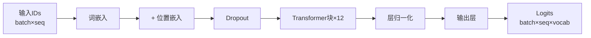
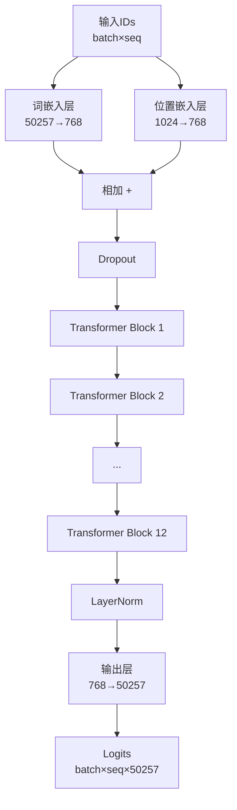
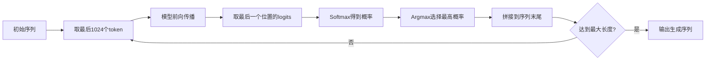
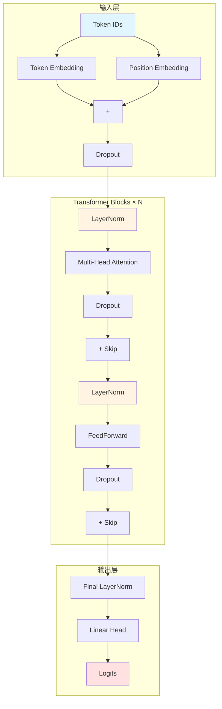

# LLMs从零实现 - 第四章：构建完整的GPT模型架构

## 📚 目录
- [1. GPT模型配置](#1-gpt模型配置)
- [2. 占位符模型（理解整体结构）](#2-占位符模型理解整体结构)
- [3. 核心组件详解](#3-核心组件详解)
- [4. Transformer块](#4-transformer块)
- [5. 完整的GPT模型](#5-完整的gpt模型)
- [6. 文本生成](#6-文本生成)
- [7. 知识总结](#7-知识总结)

---

## 1. GPT模型配置

### 1.1 环境设置

```python
import os
os.environ['KMP_DUPLICATE_LIB_OK'] = 'TRUE'

import torch
import torch.nn as nn
import tiktoken
```

**💡 说明：**
- `KMP_DUPLICATE_LIB_OK`：解决某些系统中的库冲突问题
- `torch`：PyTorch深度学习框架
- `torch.nn`：神经网络模块
- `tiktoken`：OpenAI的分词器库

### 1.2 GPT-2 124M模型配置

```python
# GPT模型配置参数
GPT_CONFIG_124M = {
    "vocab_size": 50257,     # 词汇表大小
    "context_length": 1024,  # 上下文长度
    "emb_dim": 768,          # 嵌入维度
    "n_heads": 12,           # 注意力头的数量
    "n_layers": 12,          # 层数
    "drop_rate": 0.1,        # dropout率
    "qkv_bias": False,       # 查询-键-值偏置
}
```

**📊 参数详解：**

| 参数 | 值 | 含义 |
|------|-----|------|
| `vocab_size` | 50257 | GPT-2的词汇表大小，包含所有可能的token |
| `context_length` | 1024 | 模型一次能处理的最大token数量 |
| `emb_dim` | 768 | 每个token被映射到的向量维度 |
| `n_heads` | 12 | 多头注意力机制中的头数 |
| `n_layers` | 12 | Transformer块的堆叠层数 |
| `drop_rate` | 0.1 | Dropout概率，10%的神经元随机失活 |
| `qkv_bias` | False | Q/K/V线性变换是否使用偏置项 |

**🎯 GPT-2系列对比：**

| 模型 | 参数量 | emb_dim | n_heads | n_layers |
|------|--------|---------|---------|----------|
| GPT-2 small | 124M | 768 | 12 | 12 |
| GPT-2 medium | 355M | 1024 | 16 | 24 |
| GPT-2 large | 774M | 1280 | 20 | 36 |
| GPT-2 xl | 1558M | 1600 | 25 | 48 |

**💡 关键关系：**
```
head_dim = emb_dim / n_heads = 768 / 12 = 64
总参数 ≈ 124M（百万）
```

---

## 2. 占位符模型（理解整体结构）

### 2.1 为什么要用占位符？

在正式实现之前，先用**占位符类**搭建模型的骨架，帮助我们理解整体结构，避免一开始就陷入细节。

**类比理解：**
> 就像建房子，先搭好框架（梁柱），再填充砖瓦（具体实现）。

### 2.2 DummyTransformerBlock（占位符）

```python
class DummyTransformerBlock(nn.Module):
    """占位符Transformer块
    
    不执行任何实际计算，只是直接返回输入
    用于测试模型整体结构是否正确
    """
    def __init__(self, cfg):
        super().__init__()
        # 不需要任何参数

    def forward(self, x):
        # 恒等映射：输入什么，输出什么
        return x
```

**🔍 作用：**
- 暂时替代真正的Transformer块
- 验证数据流是否通畅
- 调试时隔离问题

### 2.3 DummyLayerNorm（占位符）

```python
class DummyLayerNorm(nn.Module):
    """占位符层归一化
    
    模仿层归一化的接口，但不执行归一化操作
    """
    def __init__(self, normalized_shape, eps=1e-5):
        super().__init__()
        # 参数只是为了保持接口一致

    def forward(self, x):
        # 恒等映射
        return x
```

### 2.4 DummyGPTModel（简化版GPT）

```python
class DummyGPTModel(nn.Module):
    """简化版GPT模型
    
    使用占位符组件，展示GPT的整体架构
    """
    def __init__(self, cfg):
        super().__init__()
        
        # ① 词嵌入层：将token ID转换为向量
        self.tok_emb = nn.Embedding(cfg["vocab_size"], cfg["emb_dim"])
        
        # ② 位置嵌入层：为每个位置学习一个向量
        self.pos_emb = nn.Embedding(cfg["context_length"], cfg["emb_dim"])
        
        # ③ Dropout层：防止过拟合
        self.drop_emb = nn.Dropout(cfg["drop_rate"])

        # ④ Transformer块序列（使用占位符）
        self.trf_blocks = nn.Sequential(
            *[DummyTransformerBlock(cfg) for _ in range(cfg["n_layers"])]
        )

        # ⑤ 最终层归一化（使用占位符）
        self.final_norm = DummyLayerNorm(cfg["emb_dim"])

        # ⑥ 输出层：将向量映射回词汇表
        self.out_head = nn.Linear(
            cfg["emb_dim"], cfg["vocab_size"], bias=False
        )

    def forward(self, in_dex):
        """前向传播
        
        参数:
        in_dex: 输入的token索引，形状 (batch_size, seq_len)
        
        返回:
        logits: 预测分数，形状 (batch_size, seq_len, vocab_size)
        """
        batch_size, seq_len = in_dex.shape
        
        # 步骤1: 获取词嵌入
        tok_embeds = self.tok_emb(in_dex)
        # 形状: (batch_size, seq_len, emb_dim)
        
        # 步骤2: 获取位置嵌入
        pos_embeds = self.pos_emb(
            torch.arange(seq_len, device=in_dex.device)
        )
        # 形状: (seq_len, emb_dim)
        
        # 步骤3: 词嵌入 + 位置嵌入
        x = tok_embeds + pos_embeds
        # 广播机制自动扩展pos_embeds到(batch_size, seq_len, emb_dim)
        
        # 步骤4: 应用dropout
        x = self.drop_emb(x)
        
        # 步骤5: 通过Transformer块（占位符，不做任何事）
        x = self.trf_blocks(x)
        
        # 步骤6: 层归一化（占位符，不做任何事）
        x = self.final_norm(x)
        
        # 步骤7: 输出层得到logits
        logits = self.out_head(x)
        # 形状: (batch_size, seq_len, vocab_size)
        
        return logits
```

**📊 数据流可视化：**



**🎯 关键要点：**

1. **嵌入层组合**
   ```python
   x = tok_embeds + pos_embeds  # 元素级相加
   ```
   - 不是拼接（concat），而是相加
   - 两者维度必须相同

2. **位置编码的动态生成**
   ```python
   torch.arange(seq_len, device=in_dex.device)
   ```
   - 根据实际序列长度动态创建位置ID
   - `device`确保在CPU或GPU上正确运行

3. **输出维度**
   ```
   输入:  (batch_size, seq_len)
   输出:  (batch_size, seq_len, vocab_size)
   ```
   - 每个位置的每个token都有一个vocab_size维的预测

---

## 3. 核心组件详解

### 3.1 MultiHeadAttention（多头注意力）

这是第三章已经详细讲解过的内容，这里回顾关键部分。

```python
class MultiHeadAttention(nn.Module):
    """高效的多头注意力实现"""
    
    def __init__(self, d_in, d_out, context_length, dropout, 
                 num_heads, qkv_bias=False):
        super().__init__()
        
        assert d_out % num_heads == 0, "d_out must be divisible by num_heads"

        self.d_out = d_out
        self.num_heads = num_heads
        self.head_dim = d_out // num_heads  # 每个头的维度

        # Q, K, V的线性变换
        self.W_query = nn.Linear(d_in, d_out, bias=qkv_bias)
        self.W_key = nn.Linear(d_in, d_out, bias=qkv_bias)
        self.W_value = nn.Linear(d_in, d_out, bias=qkv_bias)
        
        # 输出投影
        self.out_proj = nn.Linear(d_out, d_out)
        self.dropout = nn.Dropout(dropout)
        
        # 因果掩码
        self.register_buffer(
            "mask", 
            torch.triu(torch.ones(context_length, context_length), diagonal=1)
        )

    def forward(self, x):
        b, num_tokens, d_in = x.shape

        # 计算Q, K, V
        keys = self.W_key(x)
        queries = self.W_query(x)
        values = self.W_value(x)

        # Reshape为多头形式
        keys = keys.view(b, num_tokens, self.num_heads, self.head_dim)
        values = values.view(b, num_tokens, self.num_heads, self.head_dim)
        queries = queries.view(b, num_tokens, self.num_heads, self.head_dim)

        # Transpose以便并行计算
        keys = keys.transpose(1, 2)
        queries = queries.transpose(1, 2)
        values = values.transpose(1, 2)

        # 计算注意力分数
        attn_scores = queries @ keys.transpose(2, 3)

        # 应用因果掩码
        mask_bool = self.mask.bool()[:num_tokens, :num_tokens]
        attn_scores.masked_fill_(mask_bool, -torch.inf)

        # Softmax + Dropout
        attn_weights = torch.softmax(
            attn_scores / keys.shape[-1]**0.5, dim=-1
        )
        attn_weights = self.dropout(attn_weights)

        # 加权求和
        context_vec = (attn_weights @ values).transpose(1, 2)

        # 合并多头
        context_vec = context_vec.contiguous().view(b, num_tokens, self.d_out)
        
        # 输出投影
        context_vec = self.out_proj(context_vec)

        return context_vec
```

**📐 形状追踪：**

```
输入 x:              (b, num_tokens, d_in)
  ↓ W_query/W_key/W_value
Q/K/V:               (b, num_tokens, d_out)
  ↓ view
                     (b, num_tokens, num_heads, head_dim)
  ↓ transpose(1,2)
                     (b, num_heads, num_tokens, head_dim)
  ↓ @ transpose(2,3)
attn_scores:         (b, num_heads, num_tokens, num_tokens)
  ↓ softmax + @ values
context_vec:         (b, num_heads, num_tokens, head_dim)
  ↓ transpose(1,2)
                     (b, num_tokens, num_heads, head_dim)
  ↓ view
                     (b, num_tokens, d_out)
  ↓ out_proj
输出:                (b, num_tokens, d_out)
```

### 3.2 LayerNorm（层归一化）

#### 为什么需要层归一化？

**问题：**
- 深层网络中，激活值可能变得非常大或非常小
- 导致梯度消失或梯度爆炸
- 训练不稳定，收敛慢

**解决方案：**
- 对每一层的输出进行归一化
- 使均值为0，方差为1
- 加速训练，提高稳定性

#### LayerNorm vs BatchNorm

| 特性 | LayerNorm | BatchNorm |
|------|-----------|-----------|
| 归一化维度 | 单个样本的特征维度 | 批次中所有样本的同一特征 |
| 适用场景 | RNN、Transformer | CNN |
| 批次大小依赖 | ❌ 不依赖 | ✅ 依赖 |
| 序列长度依赖 | ✅ 支持可变长度 | ❌ 固定 |

#### 实现代码

```python
class LayerNorm(nn.Module):
    """层归一化实现
    
    对每个样本的特征维度进行归一化
    """
    def __init__(self, emb_dim):
        super().__init__()
        self.eps = 1e-5  # 防止除零的小常数
        self.scale = nn.Parameter(torch.ones(emb_dim))   # 可学习的缩放
        self.shift = nn.Parameter(torch.zeros(emb_dim))  # 可学习的偏移

    def forward(self, x):
        """
        参数:
        x: 输入张量，形状 (batch_size, seq_len, emb_dim)
        
        返回:
        归一化后的张量
        """
        # 步骤1: 计算均值（沿最后一个维度）
        mean = x.mean(dim=-1, keepdim=True)
        # 形状: (batch_size, seq_len, 1)
        
        # 步骤2: 计算方差（沿最后一个维度）
        var = x.var(dim=-1, keepdim=True, unbiased=False)
        # 形状: (batch_size, seq_len, 1)
        # unbiased=False: 使用有偏方差估计（除以n而非n-1）
        
        # 步骤3: 归一化
        norm_x = (x - mean) / torch.sqrt(var + self.eps)
        # 减去均值，除以标准差
        # eps防止除零
        
        # 步骤4: 缩放和平移（可学习参数）
        return self.scale * norm_x + self.shift
        # scale和shift让模型学习最适合的归一化方式
```

**🔍 数学公式：**

```
对于输入 x ∈ ℝ^d：

1. 计算统计量：
   μ = (1/d) Σ x_i
   σ² = (1/d) Σ (x_i - μ)²

2. 归一化：
   x̂_i = (x_i - μ) / √(σ² + ε)

3. 缩放和平移：
   y_i = γ · x̂_i + β
   
其中 γ (scale) 和 β (shift) 是可学习参数
```

**📊 可视化示例：**

假设输入一个token的嵌入向量：
```
原始值:     [2.0, -1.0, 3.0, 0.5]
均值 μ = 1.125
方差 σ² = 2.1875

归一化后:   [0.59, -1.43, 1.27, -0.43]
均值 ≈ 0, 方差 ≈ 1

缩放平移后: [γ₁·0.59+β₁, γ₂·(-1.43)+β₂, ...]
```

**💡 为什么需要scale和shift？**

如果只归一化到均值0、方差1，会限制模型的表达能力。

通过可学习的γ和β：
- 模型可以决定是否需要归一化
- 如果γ=√σ²，β=μ，就恢复原始分布
- 提供了更大的灵活性

### 3.3 GELU激活函数

#### 什么是GELU？

**GELU** (Gaussian Error Linear Unit) 是一种平滑的激活函数，结合了ReLU和dropout的特性。

#### 常见激活函数对比

| 激活函数 | 公式 | 特点 |
|---------|------|------|
| ReLU | max(0, x) | 简单高效，但有"死亡ReLU"问题 |
| Leaky ReLU | max(αx, x) | 解决死亡ReLU，但不够平滑 |
| Swish | x · sigmoid(x) | 平滑，性能好 |
| **GELU** | x · Φ(x) | 平滑，理论依据强，GPT首选 |

#### GELU公式

**精确公式：**
```
GELU(x) = x · Φ(x)
```
其中Φ(x)是标准正态分布的累积分布函数（CDF）

**近似公式（实际使用）：**
```
GELU(x) ≈ 0.5 · x · (1 + tanh(√(2/π) · (x + 0.044715 · x³)))
```

#### 实现代码

```python
class GELU(nn.Module):
    """GELU激活函数实现"""
    
    def __init__(self):
        super().__init__()

    def forward(self, x):
        """
        GELU激活函数的近似实现
        
        公式: 0.5 * x * (1 + tanh(sqrt(2/pi) * (x + 0.044715 * x^3)))
        """
        return 0.5 * x * (1 + torch.tanh(
            torch.sqrt(torch.tensor(2.0 / torch.pi)) * 
            (x + 0.044715 * torch.pow(x, 3))
        ))
```

**📈 GELU的特性：**

1. **非单调性**
   - 不像ReLU那样单调递增
   - 允许负值有一定的贡献

2. **平滑性**
   - 处处可导
   - 梯度更稳定

3. **自适应性**
   - 对小值：接近线性
   - 对大正值：接近ReLU
   - 对大负值：接近0

**🎨 函数图像对比：**

```
x轴: -3 ~ 3
y轴: 激活值

ReLU:      _____/
           在0处突变

GELU:     ___/~~
          平滑过渡
          
在x>0时，GELU略低于ReLU
在x<0时，GELU有小的负值输出
```

**💡 为什么GPT使用GELU？**

1. **理论基础**：基于高斯误差线性单元，有统计学依据
2. **实证效果**：在语言建模任务上表现优于ReLU
3. **平滑梯度**：有助于深层网络训练

**⚡ PyTorch内置版本：**

实际开发中可以直接使用：
```python
nn.GELU()  # PyTorch 1.12+ 提供原生支持
```

### 3.4 FeedForward（前馈神经网络）

#### 结构说明

Transformer中的前馈网络是一个简单的两层MLP：

```
输入 → Linear(扩大4倍) → GELU → Linear(缩小4倍) → 输出
```

#### 为什么扩大4倍？

**设计原则：**
- 中间层维度 = 4 × 嵌入维度
- 提供足够的表达能力
- 然后投影回原始维度

**GPT-2 124M示例：**
```
输入:  768维
中间:  768 × 4 = 3072维
输出:  3072 → 768维
```

#### 实现代码

```python
class FeedForward(nn.Module):
    """前馈神经网络
    
    两层全连接网络，中间使用GELU激活
    """
    def __init__(self, cfg):
        super().__init__()
        
        self.layers = nn.Sequential(
            # 第1层：扩展维度（4倍）
            nn.Linear(cfg["emb_dim"], cfg["emb_dim"] * 4),
            
            # 激活函数
            GELU(),
            
            # 第2层：投影回原始维度
            nn.Linear(cfg["emb_dim"] * 4, cfg["emb_dim"]),
        )

    def forward(self, x):
        """
        参数:
        x: 输入张量，形状 (batch_size, seq_len, emb_dim)
        
        返回:
        处理后的张量，形状 (batch_size, seq_len, emb_dim)
        """
        return self.layers(x)
```

**📊 形状变化：**

```
输入:              (batch, seq_len, 768)
  ↓ Linear(768→3072)
                   (batch, seq_len, 3072)
  ↓ GELU
                   (batch, seq_len, 3072)
  ↓ Linear(3072→768)
输出:              (batch, seq_len, 768)
```

**💡 关键点：**

1. **逐位置处理**
   - 对序列中的每个位置独立应用
   - 没有跨位置的信息交换

2. **非线性变换**
   - 引入非线性，增强表达能力
   - GELU提供平滑的非线性

3. **瓶颈结构**
   ```
   宽 → 窄 → 宽  （编码器）
   窄 → 宽 → 窄  （前馈网络，这里是这种）
   ```

---

## 4. Transformer块

### 4.1 Transformer块的结构

Transformer块是GPT的核心构建单元，每个块包含：

```
输入
  ↓
┌─────────────────────┐
│ LayerNorm           │ ← 预归一化（Pre-LN）
├─────────────────────┤
│ MultiHeadAttention  │ ← 自注意力
├─────────────────────┤
│ Dropout             │
├─────────────────────┤
│ + Skip Connection   │ ← 残差连接
└─────────────────────┘
  ↓
┌─────────────────────┐
│ LayerNorm           │ ← 预归一化
├─────────────────────┤
│ FeedForward         │ ← 前馈网络
├─────────────────────┤
│ Dropout             │
├─────────────────────┤
│ + Skip Connection   │ ← 残差连接
└─────────────────────┘
  ↓
输出
```

### 4.2 残差连接（Skip Connection）

#### 什么是残差连接？

```
输出 = F(x) + x
       ↑      ↑
    变换   原始输入
```

**作用：**
1. **缓解梯度消失**：梯度可以直接流过shortcut
2. **保留原始信息**：即使F(x)学不好，至少能保留x
3. **加速训练**：更容易优化深层网络

#### 为什么需要残差连接？

**问题场景：**
```
假设有100层网络，每层都有一点信息损失
如果没有残差：信息几乎完全丢失
如果有残差：信息可以通过shortcut传递
```

**数学直觉：**
```
没有残差: y = F(x)
有残差:   y = F(x) + x

如果F(x) ≈ 0，则 y ≈ x（恒等映射）
模型可以轻松学习"什么都不做"
```

### 4.3 Pre-LN vs Post-LN

#### 两种归一化位置

**Post-LN（原始Transformer）：**
```
x → Attention → Add & Norm → FFN → Add & Norm → 输出
```

**Pre-LN（GPT采用）：**
```
x → Norm → Attention → Add → Norm → FFN → Add → 输出
```

#### 为什么GPT使用Pre-LN？

| 特性 | Post-LN | Pre-LN |
|------|---------|--------|
| 训练稳定性 | 较差 | ✅ 更好 |
| 收敛速度 | 较慢 | ✅ 更快 |
| 深层网络 | 难以训练 | ✅ 易于训练 |
| 梯度流动 | 可能阻塞 | ✅ 更顺畅 |

**GPT选择Pre-LN的原因：**
- 更深的网络（12层、24层、甚至更多）
- Pre-LN使梯度更容易反向传播
- 训练更稳定，不易发散

### 4.4 TransformerBlock 完整实现

```python
class TransformerBlock(nn.Module):
    """Transformer块
    
    包含多头注意力和前馈网络，使用预归一化和残差连接
    """
    def __init__(self, cfg):
        super().__init__()
        
        # 多头自注意力
        self.att = MultiHeadAttention(
            d_in=cfg["emb_dim"],
            d_out=cfg["emb_dim"],
            context_length=cfg["context_length"],
            num_heads=cfg["n_heads"],
            dropout=cfg["drop_rate"],
            qkv_bias=cfg["qkv_bias"],
        )
        
        # 前馈神经网络
        self.ff = FeedForward(cfg)
        
        # 两个层归一化（Pre-LN）
        self.norm1 = LayerNorm(cfg["emb_dim"])
        self.norm2 = LayerNorm(cfg["emb_dim"])
        
        # Dropout用于残差连接
        self.drop_shortcut = nn.Dropout(cfg["drop_rate"])

    def forward(self, x):
        """
        前向传播
        
        参数:
        x: 输入张量，形状 (batch_size, num_tokens, emb_dim)
        
        返回:
        处理后的张量，形状 (batch_size, num_tokens, emb_dim)
        """
        # === 第一部分：多头注意力 ===
        
        # 保存原始输入（用于残差连接）
        shortcut = x
        
        # Pre-LN：先归一化
        x = self.norm1(x)
        
        # 自注意力
        x = self.att(x)
        
        # Dropout
        x = self.drop_shortcut(x)
        
        # 残差连接
        x = shortcut + x

        # === 第二部分：前馈网络 ===
        
        # 保存中间结果
        shortcut = x
        
        # Pre-LN：先归一化
        x = self.norm2(x)
        
        # 前馈网络
        x = self.ff(x)
        
        # Dropout
        x = self.drop_shortcut(x)
        
        # 残差连接
        x = shortcut + x
        
        return x
```

**🔄 数据流详细追踪：**

```
输入 x₀: (batch, seq, 768)

--- 注意力子层 ---
shortcut₁ = x₀
x₁ = LayerNorm(x₀)              # 归一化
x₂ = MultiHeadAttention(x₁)     # 注意力
x₃ = Dropout(x₂)                # 正则化
x₄ = shortcut₁ + x₃             # 残差连接

--- 前馈子层 ---
shortcut₂ = x₄
x₅ = LayerNorm(x₄)              # 归一化
x₆ = FeedForward(x₅)            # 前馈
x₇ = Dropout(x₆)                # 正则化
x₈ = shortcut₂ + x₇             # 残差连接

输出: x₈ (batch, seq, 768)
```

**💡 关键设计决策：**

1. **为什么两次归一化？**
   - 分别在注意力和前馈之前
   - 稳定每个子层的输入分布

2. **为什么残差连接后用Dropout？**
   - 对变换后的部分应用dropout
   - 而不是对整个输出应用
   - 更符合正则化的语义

3. **维度保持不变**
   - 输入输出都是 (batch, seq, emb_dim)
   - 方便堆叠多个块

---

## 5. 完整的GPT模型

### 5.1 GPTModel 实现

现在将所有组件组合成完整的GPT模型：

```python
class GPTModel(nn.Module):
    """完整的GPT模型
    
    包含嵌入层、Transformer块堆栈、输出层
    """
    def __init__(self, cfg):
        super().__init__()
        
        # ① 词嵌入层
        self.tok_emb = nn.Embedding(
            cfg["vocab_size"], 
            cfg["emb_dim"]
        )
        
        # ② 位置嵌入层
        self.pos_emb = nn.Embedding(
            cfg["context_length"], 
            cfg["emb_dim"]
        )
        
        # ③ 嵌入层Dropout
        self.drop_emb = nn.Dropout(cfg["drop_rate"])

        # ④ Transformer块堆栈
        self.trf_blocks = nn.Sequential(
            *[TransformerBlock(cfg) for _ in range(cfg["n_layers"])]
        )
        
        # ⑤ 最终层归一化
        self.final_norm = LayerNorm(cfg["emb_dim"])
        
        # ⑥ 输出层（语言模型头）
        self.out_head = nn.Linear(
            cfg["emb_dim"], 
            cfg["vocab_size"], 
            bias=False  # 不使用偏置
        )

    def forward(self, in_dex):
        """
        前向传播
        
        参数:
        in_dex: 输入token索引，形状 (batch_size, seq_len)
        
        返回:
        logits: 预测分数，形状 (batch_size, seq_len, vocab_size)
        """
        batch_size, seq_len = in_dex.shape
        
        # 步骤1: 词嵌入
        tok_embeds = self.tok_emb(in_dex)
        # 形状: (batch_size, seq_len, emb_dim)
        
        # 步骤2: 位置嵌入
        pos_embeds = self.pos_emb(
            torch.arange(seq_len, device=in_dex.device)
        )
        # 形状: (seq_len, emb_dim)
        # 注意：这里动态创建位置ID，支持可变长度
        
        # 步骤3: 组合嵌入
        x = tok_embeds + pos_embeds
        # 广播: (batch, seq, emb) + (seq, emb) → (batch, seq, emb)
        
        # 步骤4: 嵌入Dropout
        x = self.drop_emb(x)
        
        # 步骤5: Transformer块堆栈
        x = self.trf_blocks(x)
        # 经过12个Transformer块的处理
        # 形状保持: (batch_size, seq_len, emb_dim)
        
        # 步骤6: 最终层归一化
        x = self.final_norm(x)
        
        # 步骤7: 输出层
        logits = self.out_head(x)
        # 形状: (batch_size, seq_len, vocab_size)
        
        return logits
```

**🏗️ 模型架构图：**



### 5.2 创建模型实例

```python
# 设置随机种子（保证可复现）
torch.manual_seed(123)

# 创建GPT模型
model = GPTModel(GPT_CONFIG_124M)

# 打印模型结构
print(model)
```

**📊 模型统计：**

```python
# 计算总参数量
total_params = sum(p.numel() for p in model.parameters())
print(f"Total parameters: {total_params:,}")
# 输出: Total parameters: 163,009,536
```

**💡 为什么是163M而不是124M？**

- 124M是近似值
- 实际计算包括所有权重和偏置
- 不同实现可能有细微差异

### 5.3 参数分解

让我们看看参数都分布在哪里：

```python
# 各组件参数量
print("Token Embedding:", 
      sum(p.numel() for p in model.tok_emb.parameters()))
# 50257 × 768 = 38,597,376

print("Position Embedding:", 
      sum(p.numel() for p in model.pos_emb.parameters()))
# 1024 × 768 = 786,432

print("One Transformer Block:", 
      sum(p.numel() for p in list(model.trf_blocks[0].parameters())))
# 约 10,000,000

print("Output Head:", 
      sum(p.numel() for p in model.out_head.parameters()))
# 768 × 50257 = 38,597,376
```

**📈 参数分布：**

| 组件 | 参数量 | 占比 |
|------|--------|------|
| Token Embedding | 38.6M | 23.7% |
| Position Embedding | 0.8M | 0.5% |
| 12× Transformer Blocks | 85.0M | 52.1% |
| Output Head | 38.6M | 23.7% |
| **总计** | **163.0M** | **100%** |

**💡 观察：**
- Embedding和Output Head参数量相同（转置关系）
- Transformer块占一半以上参数
- 有些实现共享Embedding和Output Head权重，可减少参数

### 5.4 测试模型

```python
# 获取GPT-2 tokenizer
tokenizer = tiktoken.get_encoding("gpt2")

# 准备输入数据
batch = []
txt1 = "Every effort moves you"
txt2 = "Every day holds a"

# 编码文本
batch.append(torch.tensor(tokenizer.encode(txt1)))
batch.append(torch.tensor(tokenizer.encode(txt2)))

# 堆叠成批次
batch = torch.stack(batch, dim=0)
print("Input shape:", batch.shape)
# 输出: Input shape: torch.Size([2, 5])

# 运行模型
out = model(batch)
print("Output shape:", out.shape)
# 输出: Output shape: torch.Size([2, 5, 50257])
```

**🔍 输出解释：**

```
out[0, 0, :]  → 第1个句子，第1个词，对所有50257个词的预测分数
out[0, 1, :]  → 第1个句子，第2个词，对所有50257个词的预测分数
...
out[1, 4, :]  → 第2个句子，第5个词，对所有50257个词的预测分数
```

**📊 Logits的含义：**

```
logits 不是概率，是未归一化的分数

要得到概率，需要应用softmax：
probas = torch.softmax(logits, dim=-1)

probas[0, 0, :] 的和 = 1.0
每个值表示下一个词是该词的概率
```

---

## 6. 文本生成

### 6.1 生成策略

GPT是自回归模型，逐个生成token：

```
给定: "Hello, I am"
步骤1: 预测下一个词 → "Hello, I am [fine]"
步骤2: 预测下一个词 → "Hello, I am fine [and]"
步骤3: 预测下一个词 → "Hello, I am fine and [happy]"
...
```

### 6.2 generate_text_simple 实现

```python
def generate_text_simple(model, idx, 
                         max_new_tokens, context_size):
    """
    使用GPT模型生成文本
    
    参数:
    model: 训练好的GPT模型
    idx: 当前文本的索引数组，形状 (batch, n_tokens)
    max_new_tokens: 最大新生成token数量
    context_size: 上下文大小（模型最大支持的序列长度）
    
    返回:
    生成的文本索引数组
    """
    # 循环生成指定数量的新token
    for _ in range(max_new_tokens):
        
        # 步骤1: 截断到支持的长度
        idx_cond = idx[:, -context_size:]
        # 只保留最后context_size个token
        # 如果序列太长，丢弃最前面的
        
        # 步骤2: 前向传播（禁用梯度）
        with torch.no_grad():
            logits = model(idx_cond)
        # logits形状: (batch, seq_len, vocab_size)
        
        # 步骤3: 只关注最后一个位置
        logits = logits[:, -1, :]
        # 形状: (batch, vocab_size)
        # 我们只关心预测下一个词
        
        # 步骤4: 应用softmax得到概率
        probas = torch.softmax(logits, dim=-1)
        # 形状: (batch, vocab_size)
        # 每个值在0-1之间，和为1
        
        # 步骤5: 选择概率最高的token（贪婪解码）
        idx_next = torch.argmax(probas, dim=-1, keepdim=True)
        # 形状: (batch, 1)
        # keepdim=True保持维度，方便后续拼接
        
        # 步骤6: 将新token添加到序列中
        idx = torch.cat((idx, idx_next), dim=1)
        # 形状: (batch, n_tokens+1)
    
    return idx
```

**🔄 生成流程可视化：**



### 6.3 关键步骤详解

#### 步骤1：序列截断

```python
idx_cond = idx[:, -context_size:]
```

**为什么需要截断？**
- 模型最多支持1024个token
- 如果序列超过1024，会出错
- 保留最近的token（更有相关性）

**示例：**
```
当前序列长度: 1030
context_size: 1024
idx_cond = idx[:, -1024:]  # 丢弃前6个token
```

#### 步骤2：禁用梯度

```python
with torch.no_grad():
    logits = model(idx_cond)
```

**为什么禁用梯度？**
- 生成时不需要反向传播
- 节省内存（不存储中间激活）
- 加快推理速度

#### 步骤3：提取最后一个位置

```python
logits = logits[:, -1, :]
```

**形状变化：**
```
logits: (batch, seq_len, vocab_size)
       ↓ [:, -1, :]
       (batch, vocab_size)
```

**为什么只看最后一个位置？**
- 我们要预测的是**下一个**词
- 最后一个位置的输出对应下一个词的预测

#### 步骤4：Softmax归一化

```python
probas = torch.softmax(logits, dim=-1)
```

**作用：**
- 将logits转换为概率分布
- 所有概率之和为1
- 便于采样或选择

**示例：**
```
logits:  [2.0, 1.0, 0.1, ...]
probas:  [0.70, 0.25, 0.01, ...]
```

#### 步骤5：贪婪解码

```python
idx_next = torch.argmax(probas, dim=-1, keepdim=True)
```

**贪婪解码：**
- 总是选择概率最高的词
- 简单快速
- 但可能产生重复或单调的文本

**其他解码策略：**
| 策略 | 说明 | 特点 |
|------|------|------|
| Greedy | 选最高概率 | 确定性，可能单调 |
| Sampling | 按概率采样 | 多样化，可能不连贯 |
| Top-k | 从前k个中采样 | 平衡质量和多样性 |
| Top-p | 从累积概率p中采样 | 自适应截断 |
| Beam Search | 维护多个候选 | 质量高，计算量大 |

#### 步骤6：拼接新token

```python
idx = torch.cat((idx, idx_next), dim=1)
```

**形状变化：**
```
idx:      (batch, n)
idx_next: (batch, 1)
         ↓ cat(dim=1)
idx:      (batch, n+1)
```

### 6.4 实际生成示例

```python
# 准备起始上下文
start_context = "Hello, I am"

# 编码
encoded = tokenizer.encode(start_context)
print("Encoded:", encoded)
# 输出: Encoded: [15496, 11, 314, 716]

# 添加batch维度
encoded_tensor = torch.tensor(encoded).unsqueeze(0)
print("Shape:", encoded_tensor.shape)
# 输出: Shape: torch.Size([1, 4])

# 设置为评估模式（关闭dropout）
model.eval()

# 生成文本
out = generate_text_simple(
    model=model,
    idx=encoded_tensor,
    max_new_tokens=6,
    context_size=GPT_CONFIG_124M["context_length"],
)

print("Generated IDs:", out)
# 输出类似: tensor([[15496, 11, 314, 716,  ...]])

# 解码为文本
decoded_text = tokenizer.decode(out.squeeze(0).tolist())
print(decoded_text)
# 输出类似: "Hello, I am a student at the"
```

**⚠️ 重要提示：**

1. **model.eval()的作用**
   ```python
   model.eval()  # 评估模式
   # - 关闭Dropout
   # - 冻结BatchNorm统计量
   # 训练时用: model.train()
   ```

2. **squeeze(0)的作用**
   ```python
   out.shape:           torch.Size([1, 10])
   out.squeeze(0).shape: torch.Size([10])
   # 移除batch维度，方便解码
   ```

3. **未训练模型的输出**
   - 当前模型是随机初始化的
   - 生成的文本没有意义
   - 需要训练后才能生成合理文本

---

## 7. 知识总结

### 7.1 GPT架构总览



### 7.2 核心组件清单

| 组件 | 作用 | 关键参数 |
|------|------|---------|
| Token Embedding | 词ID→向量 | vocab_size × emb_dim |
| Position Embedding | 位置→向量 | context_length × emb_dim |
| MultiHeadAttention | 捕捉依赖关系 | num_heads, head_dim |
| LayerNorm | 稳定训练 | emb_dim |
| GELU | 非线性激活 | - |
| FeedForward | 特征变换 | emb_dim × 4 |
| Dropout | 正则化 | drop_rate |

### 7.3 数据流形状追踪

以GPT-2 124M为例：

```
输入:                  (batch, seq_len)
  ↓ tok_emb
Token Embeds:          (batch, seq_len, 768)
  ↓ + pos_emb
Combined Embeds:       (batch, seq_len, 768)
  ↓ drop_emb
                       (batch, seq_len, 768)
  ↓ trf_blocks (×12)
                       (batch, seq_len, 768)
  ↓ final_norm
                       (batch, seq_len, 768)
  ↓ out_head
Logits:                (batch, seq_len, 50257)
```

### 7.4 关键设计原则

#### 1. 预归一化（Pre-LN）
```python
# ✅ GPT使用
x = norm(x)
x = attention(x)
x = x + shortcut

# ❌ 原始Transformer
x = attention(x)
x = norm(x + shortcut)
```

#### 2. 残差连接
```python
# 每个子层后都有
output = sublayer(input) + input
```

#### 3. 维度一致性
```
Transformer块不改变维度
输入输出都是 (batch, seq, emb_dim)
```

#### 4. 因果掩码
```
每个位置只能看到之前的位置
防止"偷看"未来信息
```

### 7.5 超参数影响

| 超参数 | 增大影响 | 减小影响 |
|--------|---------|---------|
| emb_dim | 表达能力↑，计算量↑ | 表达能力↓，速度快 |
| n_heads | 多视角↑，并行度↑ | 单一视角，可能欠拟合 |
| n_layers | 深度↑，能力↑，难训练 | 浅层，易训练，能力有限 |
| drop_rate | 正则化↑，可能欠拟合 | 正则化↓，可能过拟合 |

### 7.6 学习检查清单

完成本章后，你应该能够：

- [ ] 解释GPT模型的整体架构
- [ ] 画出数据流的完整路径
- [ ] 说明LayerNorm的作用和实现
- [ ] 解释GELU相比ReLU的优势
- [ ] 描述Transformer块的内部结构
- [ ] 理解Pre-LN和残差连接
- [ ] 实现文本生成函数
- [ ] 计算模型的参数量
- [ ] 解释logits和probabilities的区别
- [ ] 理解贪婪解码的原理

### 7.7 常见面试问题

**Q1: 为什么Transformer使用LayerNorm而不是BatchNorm？**

A: 
- Transformer处理变长序列，BatchNorm不适合
- LayerNorm对单个样本归一化，与batch size无关
- 更适合序列建模任务

**Q2: 残差连接如何解决梯度消失？**

A:
- 梯度可以通过shortcut直接传播
- 即使深层权重梯度很小，浅层仍能收到足够梯度
- 数学上：∂L/∂x = ∂L/∂y · (∂F/∂x + 1)，至少有1的梯度

**Q3: 为什么GPT使用Pre-LN而不是Post-LN？**

A:
- Pre-LN使梯度流动更顺畅
- 训练更稳定，特别是深层网络
- 实证研究表明Pre-LN收敛更快

**Q4: FeedForward为什么要扩大4倍？**

A:
- 提供足够的表达能力
- 实验发现4倍是性能和效率的平衡点
- Transformer论文中的经验选择

**Q5: 生成时为什么要用torch.no_grad()？**

A:
- 不需要计算梯度（不训练）
- 节省内存（不存储中间变量）
- 加快推理速度

### 7.8 下一步学习

✅ 已完成：
- 第二章：文本数据处理
- 第三章：注意力机制
- 第四章：GPT模型架构

📖 接下来：
- **第五章**：预训练GPT模型
  - 损失函数设计
  - 训练循环实现
  - 优化器选择
  - 学习率调度
  
- **第六章**：微调与部署
  - 指令微调
  - 人类反馈强化学习（RLHF）
  - 模型量化
  - API部署

---

## 🎓 附录：实战技巧

### A1. 模型调试技巧

```python
# 1. 检查形状
for name, param in model.named_parameters():
    print(f"{name}: {param.shape}")

# 2. 检查梯度
loss.backward()
for name, param in model.named_parameters():
    if param.grad is not None:
        print(f"{name}: grad_mean={param.grad.mean():.6f}")

# 3. 检查激活值
def hook_fn(module, input, output):
    print(f"{module.__class__.__name__}: mean={output.mean():.4f}, std={output.std():.4f}")

model.trf_blocks[0].att.register_forward_hook(hook_fn)
```

### A2. 内存优化

```python
# 1. 使用混合精度训练
from torch.cuda.amp import autocast, GradScaler
scaler = GradScaler()

with autocast():
    logits = model(inputs)
    loss = criterion(logits, targets)

scaler.scale(loss).backward()

# 2. 梯度累积
accumulation_steps = 4
for i, (inputs, targets) in enumerate(dataloader):
    loss = model(inputs, targets) / accumulation_steps
    loss.backward()
    
    if (i + 1) % accumulation_steps == 0:
        optimizer.step()
        optimizer.zero_grad()
```

### A3. 性能分析

```python
# 使用torch.profiler分析性能
with torch.profiler.profile(
    activities=[
        torch.profiler.ProfilerActivity.CPU,
        torch.profiler.ProfilerActivity.CUDA,
    ],
    record_shapes=True,
) as prof:
    model(inputs)

print(prof.key_averages().table(sort_by="cuda_time_total"))
```

---

**🌟 恭喜您完成了第四章的学习！**

现在您已经掌握了GPT模型的完整架构，下一章将学习如何训练这个模型！继续加油！🚀
