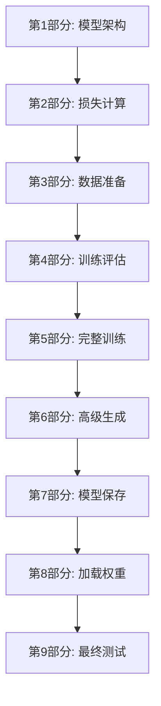
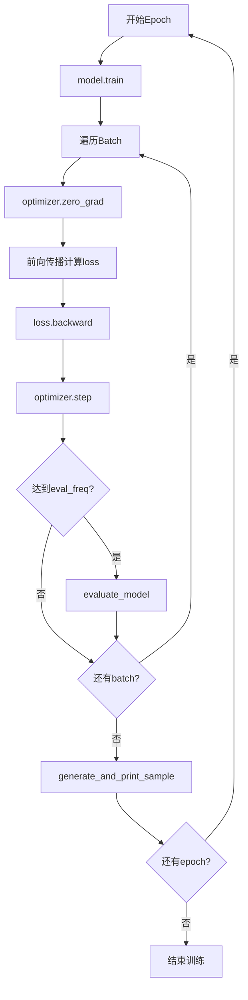

# LLMs从零实现 - 第五章：预训练GPT模型完全指南

## 📚 目录
- [1. 本章概览](#1-本章概览)
- [2. GPT模型回顾](#2-gpt模型回顾)
- [3. 文本生成基础](#3-文本生成基础)
- [4. 损失函数详解](#4-损失函数详解)
- [5. 数据准备](#5-数据准备)
- [6. 训练循环实现](#6-训练循环实现)
- [7. 高级文本生成策略](#7-高级文本生成策略)
- [8. 模型保存与加载](#8-模型保存与加载)
- [9. 加载官方GPT-2权重](#9-加载官方gpt-2权重)
- [10. 知识总结](#10-知识总结)

---

## 1. 本章概览

### 1.1 学习目标

完成本章后，你将能够：
- ✅ 理解语言模型的训练目标
- ✅ 实现交叉熵损失函数
- ✅ 构建完整的训练循环
- ✅ 使用不同的解码策略生成文本
- ✅ 保存和加载模型参数
- ✅ 加载预训练的GPT-2权重

### 1.2 章节结构



### 1.3 环境设置

```python
import os
os.environ["KMP_DUPLICATE_LIB_OK"] = "TRUE"

import torch
import torch.nn as nn
import tiktoken
```

**💡 说明：**
- `KMP_DUPLICATE_LIB_OK`：解决Intel MKL库冲突问题（Windows常见）
- 这是PyTorch训练的标准导入

---

## 2. GPT模型回顾

这部分代码在第四章已经详细讲解过，这里快速回顾核心组件。

### 2.1 核心组件清单

| 组件 | 作用 | 代码行 |
|------|------|--------|
| MultiHeadAttention | 多头注意力机制 | 22-94 |
| LayerNorm | 层归一化 | 96-110 |
| GELU | 激活函数 | 112-120 |
| FeedForward | 前馈网络 | 122-133 |
| TransformerBlock | Transformer块 | 135-168 |
| GPTModel | 完整GPT模型 | 170-204 |

### 2.2 模型配置

```python
GPT_CONFIG_124M = {
    "vocab_size": 50257,      # 词汇表大小
    "context_length": 256,    # 上下文长度（缩短以便快速训练）
    "emb_dim": 768,           # 嵌入维度
    "n_heads": 12,            # 注意力头数
    "n_layers": 12,           # Transformer层数
    "drop_rate": 0.1,         # Dropout概率
    "qkv_bias": False,        # QKV是否使用偏置
}

# 创建模型实例
model = GPTModel(GPT_CONFIG_124M)
```

**📊 配置说明：**
- `context_length=256`：比标准的1024短，加快训练速度
- 其他参数与GPT-2 small保持一致

---

## 3. 文本生成基础

### 3.1 贪心解码（Greedy Decoding）

```python
def generate_text_simple(model, idx, max_new_tokens, context_size):
    """
    简单的贪心文本生成
    
    参数:
    model: GPT模型
    idx: 输入token IDs，形状 (batch, n_tokens)
    max_new_tokens: 最大生成token数
    context_size: 模型支持的最大上下文长度
    
    返回:
    生成的token IDs
    """
    for _ in range(max_new_tokens):
        # 步骤1: 截断到支持的长度
        idx_cond = idx[:, -context_size:]
        
        # 步骤2: 前向传播（禁用梯度）
        with torch.no_grad():
            logits = model(idx_cond)
        
        # 步骤3: 只取最后一个位置
        logits = logits[:, -1, :]
        
        # 步骤4: Softmax得到概率
        probas = torch.softmax(logits, dim=-1)
        
        # 步骤5: 选择概率最高的token（贪心）
        idx_next = torch.argmax(probas, dim=-1, keepdim=True)
        
        # 步骤6: 拼接到序列末尾
        idx = torch.cat((idx, idx_next), dim=1)
    
    return idx
```

**🔄 生成流程：**

```
初始: "Every effort moves you"
       ↓
迭代1: 预测下一个词 → "Every effort moves you [forward]"
       ↓
迭代2: 预测下一个词 → "Every effort moves you forward [to]"
       ↓
迭代3: 预测下一个词 → "Every effort moves you forward to [the]"
       ↓
...
```

**⚠️ 贪心解码的特点：**
- ✅ 简单、确定性
- ❌ 可能产生重复、单调的文本
- ❌ 缺乏多样性

### 3.2 工具函数

```python
def text_to_token_ids(text, tokenizer):
    """文本 → token IDs"""
    encoded = tokenizer.encode(text, allowed_special={'<|endoftext|>'})
    encoded_tensor = torch.tensor(encoded).unsqueeze(0)  # 添加batch维度
    return encoded_tensor

def token_ids_to_text(token_ids, tokenizer):
    """token IDs → 文本"""
    flat = token_ids.squeeze(0)  # 移除batch维度
    return tokenizer.decode(flat.tolist())
```

**📝 使用示例：**

```python
start_context = "Every effort moves you"
tokenizer = tiktoken.get_encoding("gpt2")

# 编码
token_ids = text_to_token_ids(start_context, tokenizer)
print("Token IDs:", token_ids)
# 输出: tensor([[ 9273,  3055,  5061,   345]])

# 生成
token_ids = generate_text_simple(
    model=model,
    idx=token_ids,
    max_new_tokens=10,
    context_size=GPT_CONFIG_124M["context_length"],
)

# 解码
print("Output text:\n", token_ids_to_text(token_ids, tokenizer))
# 输出: "Every effort moves you ..."（随机初始化的模型输出无意义）
```

---

## 4. 损失函数详解

### 4.1 理解监督学习信号

#### 输入-目标对齐

```python
# 示例：展示输入和目标如何对齐
inputs = torch.tensor([
    [16833, 3626, 6100],   # ["every effort moves"]
    [40,    1107, 588]     # ["I really like"]
])

targets = torch.tensor([
    [3626,  6100, 345],    # ["effort moves you"]
    [1107,  588,  11311]   # ["really like chocolate"]
])
```

**🎯 关键观察：**

```
样本1:
输入:  [every,   effort, moves]
目标:  [effort,  moves,  you]
       ↑每个位置的目标是输入的下一个词

样本2:
输入:  [I,       really, like]
目标:  [really,  like,   chocolate]
```

**为什么这样设计？**
- 语言模型的目标：预测下一个词
- 输入是上下文，目标是正确答案
- 模型学习根据上文预测下文

### 4.2 模型输出解析

```python
with torch.no_grad():
    logits = model(inputs)

print("Logits shape:", logits.shape)
# 输出: torch.Size([2, 3, 50257])
# 含义: (batch_size=2, seq_len=3, vocab_size=50257)
```

**📊 Logits的含义：**

```
logits[0, 0, :]  → 第1个样本，第1个位置，对所有50257个词的原始打分
logits[0, 1, :]  → 第1个样本，第2个位置，对所有50257个词的原始打分
...
logits[1, 2, :]  → 第2个样本，第3个位置，对所有50257个词的原始打分
```

**Logits vs Probabilities：**
- **Logits**：未归一化的分数，可以是任意实数
- **Probabilities**：经过Softmax后的概率，范围[0,1]，和为1

### 4.3 转换为概率

```python
probas = torch.softmax(logits, dim=-1)
print("Probabilities shape:", probas.shape)
# 输出: torch.Size([2, 3, 50257])

# 验证每行的和为1
print("Sum of probabilities:", probas.sum(dim=-1))
# 输出: tensor([[1., 1., 1.], [1., 1., 1.]])
```

### 4.4 贪婪预测

```python
# 选择每个位置概率最高的token
token_ids = torch.argmax(probas, dim=-1, keepdim=True)
print("Token IDs:\n", token_ids)
# 输出: 模型"最想猜"的词

# 对比目标和预测
print(f"Targets batch 1: {token_ids_to_text(targets[0], tokenizer)}")
print(f"Outputs batch 1: {token_ids_to_text(token_ids[0].flatten(), tokenizer)}")
```

**🔍 输出示例：**
```
Targets batch 1: effort moves you
Outputs batch 1: the the the  ← 随机初始化的模型只会输出高频词
```

### 4.5 计算正确答案的概率

#### 方法1：手动提取

```python
# 样本1：提取正确答案位置的概率
text_idx = 0
target_probas_1 = probas[text_idx, [0, 1, 2], targets[text_idx]]
print("Text 1:", target_probas_1)
# 解释: 
#   位置0，正确答案是targets[0,0]=3626，提取probas[0, 0, 3626]
#   位置1，正确答案是targets[0,1]=6100，提取probas[0, 1, 6100]
#   位置2，正确答案是targets[0,2]=345， 提取probas[0, 2, 345]

# 样本2
text_idx = 1
target_probas_2 = probas[text_idx, [0, 1, 2], targets[text_idx]]
print("Text 2:", target_probas_2)
```

**📐 索引技巧：**

```python
# PyTorch的高级索引
probas[text_idx, [0, 1, 2], targets[text_idx]]
# 等价于:
[
    probas[text_idx, 0, targets[text_idx, 0]],
    probas[text_idx, 1, targets[text_idx, 1]],
    probas[text_idx, 2, targets[text_idx, 2]],
]
```

#### 方法2：对数概率

```python
# 拼接两个样本的正确概率
log_probas = torch.log(torch.cat((target_probas_1, target_probas_2)))
print("Log probabilities:", log_probas)

# 平均对数概率
avg_log_probas = torch.mean(log_probas)
print("Average log prob:", avg_log_probas)

# 取负号得到损失（越小越好）
neg_avg_log_probas = avg_log_probas * -1
print("Negative avg log prob:", neg_avg_log_probas)
```

**❓ 为什么要用对数？**

1. **数值稳定性**
   ```
   概率相乘: 0.1 × 0.2 × 0.3 = 0.006（很小）
   对数相加: log(0.1) + log(0.2) + log(0.3) = -2.3 + -1.6 + -1.2 = -5.1
   ```

2. **数学等价**
   ```
   log(a × b × c) = log(a) + log(b) + log(c)
   ```

3. **优化友好**
   - 对数转换使乘法变加法
   - 梯度计算更稳定

### 4.6 交叉熵损失（标准方法）

#### 为什么需要Flatten？

```python
print("Logits shape:", logits.shape)      # (2, 3, 50257)
print("Targets shape:", targets.shape)    # (2, 3)

# PyTorch的cross_entropy要求:
# - logits: 2D张量 (N, C)，N=样本数，C=类别数
# - targets: 1D张量 (N,)，每个值是类别索引

# 所以需要展平
logits_flat = logits.flatten(0, 1)       # (6, 50257)
targets_flat = targets.flatten()          # (6,)

print("Flattened logits:", logits_flat.shape)   # torch.Size([6, 50257])
print("Flattened targets:", targets_flat.shape) # torch.Size([6])
```

**📊 Flatten可视化：**

```
原始Logits (2, 3, 50257):
样本1: [位置0, 位置1, 位置2]
样本2: [位置0, 位置1, 位置2]

展平后 (6, 50257):
[样本1-位置0, 样本1-位置1, 样本1-位置2,
 样本2-位置0, 样本2-位置1, 样本2-位置2]

每个位置都是一个独立的分类问题！
```

#### 计算交叉熵

```python
loss = torch.nn.functional.cross_entropy(logits_flat, targets_flat)
print("Loss:", loss)
# 输出: 一个标量值，表示模型预测的平均误差
```

**🎯 交叉熵公式：**

```
对于单个样本:
CE = -Σ y_i · log(p_i)

其中:
- y_i: 真实标签（one-hot编码）
- p_i: 预测概率

简化后（因为只有一个正确答案）:
CE = -log(p_correct)
```

**示例计算：**
```
假设正确答案的概率是0.3:
CE = -log(0.3) = 1.20

如果概率提升到0.8:
CE = -log(0.8) = 0.22

损失越小 → 模型越自信 → 预测越准确
```

### 4.7 封装损失计算函数

```python
def calc_loss_batch(input_batch, target_batch, model, device):
    """
    计算单个batch的损失
    
    参数:
    input_batch: 输入IDs，形状 (batch, seq_len)
    target_batch: 目标IDs，形状 (batch, seq_len)
    model: GPT模型
    device: 计算设备（CPU/GPU）
    
    返回:
    loss: 标量损失值
    """
    # 移到指定设备
    input_batch = input_batch.to(device)
    target_batch = target_batch.to(device)
    
    # 前向传播
    logits = model(input_batch)
    
    # 计算交叉熵损失
    loss = torch.nn.functional.cross_entropy(
        logits.flatten(0, 1),  # (batch*seq_len, vocab_size)
        target_batch.flatten()  # (batch*seq_len,)
    )
    
    return loss
```

**💡 关键点：**
- 自动处理设备迁移
- 统一flatten逻辑
- 可复用于训练和验证

---

## 5. 数据准备

### 5.1 加载文本数据

```python
# 读取《The Verdict》文本
file_path = "the-verdict.txt"
with open(file_path, "r", encoding="utf-8") as file:
    text_data = file.read()

# 统计字符数和token数
total_characters = len(text_data)
total_tokens = len(tokenizer.encode(text_data))
print("Characters:", total_characters)
print("Tokens:", total_tokens)
```

**📊 数据集规模：**
- 字符数：约20,000+
- Token数：约5,000+（取决于分词器）

### 5.2 划分训练集和验证集

```python
# 按90:10划分
train_ratio = 0.90
split_idx = int(train_ratio * len(text_data))
train_data = text_data[:split_idx]   # 前90%
val_data = text_data[split_idx:]     # 后10%
```

**🎯 为什么要划分？**

| 数据集 | 用途 | 比例 |
|--------|------|------|
| 训练集 | 更新模型参数 | 90% |
| 验证集 | 评估泛化能力 | 10% |
| 测试集 | 最终性能评估 | （本章未使用） |

**⚠️ 过拟合检测：**
```
训练损失下降，验证损失上升 → 过拟合
训练损失和验证损失都下降 → 正常学习
训练损失和验证损失都不降 → 欠拟合
```

### 5.3 GPTDatasetV1 数据集类

```python
from torch.utils.data import Dataset

class GPTDatasetV1(Dataset):
    """
    GPT数据集类
    
    将长文本切分为固定长度的重叠窗口
    每个样本：输入是前面的token，目标是右移1位的token
    """
    def __init__(self, txt, tokenizer, max_length, stride):
        self.input_ids = []
        self.target_ids = []

        # 对整个文本分词
        token_ids = tokenizer.encode(txt)
        
        # 滑动窗口切分
        for i in range(0, len(token_ids) - max_length, stride):
            # 输入：从位置i开始的max_length个token
            input_ids = token_ids[i: i + max_length]
            
            # 目标：从位置i+1开始的max_length个token（右移1位）
            target_ids = token_ids[i + 1: i + 1 + max_length]
            
            self.input_ids.append(torch.tensor(input_ids))
            self.target_ids.append(torch.tensor(target_ids))

    def __len__(self):
        """返回样本总数"""
        return len(self.input_ids)

    def __getitem__(self, idx):
        """获取第idx个样本"""
        return self.input_ids[idx], self.target_ids[idx]
```

**📊 滑动窗口可视化：**

假设文本tokens为 `[t0, t1, t2, t3, t4, t5, t6, t7]`，`max_length=3`，`stride=2`：

```
样本1:
  Input:  [t0, t1, t2]
  Target: [t1, t2, t3]

样本2: (跳过stride=2个位置)
  Input:  [t2, t3, t4]
  Target: [t3, t4, t5]

样本3:
  Input:  [t4, t5, t6]
  Target: [t5, t6, t7]
```

**🔑 关键参数：**

| 参数 | 作用 | 影响 |
|------|------|------|
| `max_length` | 序列长度 | 决定上下文窗口大小 |
| `stride` | 滑动步长 | 控制样本重叠程度 |

**Stride的影响：**
- `stride < max_length`：样本有重叠，数据利用率高
- `stride = max_length`：样本无重叠，效率高但可能丢失信息
- `stride > max_length`：样本之间有间隙，可能丢失信息

### 5.4 创建DataLoader

```python
def create_dataloader_V1(
    txt, 
    batch_size=4, 
    max_length=256, 
    stride=128, 
    shuffle=True, 
    drop_last=True, 
    num_workers=0
):
    """
    创建数据加载器
    
    参数:
    txt: 原始文本
    batch_size: 批次大小
    max_length: 序列长度
    stride: 滑动步长
    shuffle: 是否打乱数据
    drop_last: 是否丢弃最后一个不完整批次
    num_workers: 数据加载的CPU进程数
    
    返回:
    DataLoader对象
    """
    tokenizer = tiktoken.get_encoding("gpt2")
    dataset = GPTDatasetV1(txt, tokenizer, max_length, stride)
    
    dataloader = torch.utils.data.DataLoader(
        dataset,
        batch_size=batch_size,
        shuffle=shuffle,
        drop_last=drop_last,
        num_workers=num_workers,
    )
    
    return dataloader
```

**📋 参数详解：**

| 参数 | 默认值 | 说明 |
|------|--------|------|
| `batch_size` | 4 | 每个批次的样本数 |
| `shuffle` | True | 训练时打乱，验证时不打乱 |
| `drop_last` | True | 丢弃不完整批次，保证batch大小一致 |
| `num_workers` | 0 | 多进程加载，0表示单进程 |

### 5.5 创建训练和验证加载器

```python
torch.manual_seed(123)

# 训练集加载器
train_loader = create_dataloader_V1(
    train_data,
    batch_size=2,
    max_length=GPT_CONFIG_124M["context_length"],  # 256
    stride=GPT_CONFIG_124M["context_length"],      # 256（无重叠）
    drop_last=True,
    shuffle=True,
    num_workers=0,
)

# 验证集加载器
val_loader = create_dataloader_V1(
    val_data,
    batch_size=2,
    max_length=GPT_CONFIG_124M["context_length"],
    stride=GPT_CONFIG_124M["context_length"],
    drop_last=False,  # 验证集保留所有数据
    shuffle=False,    # 验证集不打乱
    num_workers=0,
)
```

**🔍 验证数据形状：**

```python
print("Train loader:")
for x, y in train_loader:
    print(x.shape, y.shape)
    break
# 输出: torch.Size([2, 256]) torch.Size([2, 256])

print("\nValidation loader:")
for x, y in val_loader:
    print(x.shape, y.shape)
    break
# 输出: torch.Size([2, 256]) torch.Size([2, 256])
```

**✅ 形状检查：**
- `x`: (batch_size=2, seq_len=256)
- `y`: (batch_size=2, seq_len=256)
- 输入和目标形状一致

---

## 6. 训练循环实现

### 6.1 评估函数

#### 批量损失计算

```python
def calc_loss_batch(input_batch, target_batch, model, device):
    """计算单个batch的损失"""
    input_batch = input_batch.to(device)
    target_batch = target_batch.to(device)
    logits = model(input_batch)
    loss = torch.nn.functional.cross_entropy(
        logits.flatten(0, 1), 
        target_batch.flatten()
    )
    return loss
```

#### 数据集损失计算

```python
def calc_loss_loader(data_loader, model, device, num_batches=None):
    """
    计算整个数据集的平均损失
    
    参数:
    data_loader: 数据加载器
    model: 模型
    device: 设备
    num_batches: 评估的batch数（None表示全部）
    
    返回:
    平均损失
    """
    total_loss = 0.
    
    if len(data_loader) == 0:
        return float("nan")
    elif num_batches is None:
        num_batches = len(data_loader)
    else:
        # 限制评估的batch数，加快速度
        num_batches = min(num_batches, len(data_loader))
    
    for i, (input_batch, target_batch) in enumerate(data_loader):
        if i < num_batches:
            loss = calc_loss_batch(input_batch, target_batch, model, device)
            total_loss += loss.item()
        else:
            break
    
    return total_loss / num_batches
```

**💡 为什么限制num_batches？**
- 完整评估可能很慢
- 抽样评估可以快速估计性能
- 训练过程中频繁评估会影响训练速度

### 6.2 设备选择

```python
# 自动选择GPU或CPU
device = torch.device("cuda" if torch.cuda.is_available() else "cpu")
print("Using device:", device)

# 将模型移到设备上
model = model.to(device)
```

**🖥️ 设备对比：**

| 设备 | 速度 | 适用场景 |
|------|------|---------|
| CPU | 慢 | 小模型、推理、调试 |
| GPU | 快10-100倍 | 大模型、训练 |

### 6.3 初始损失评估

```python
with torch.no_grad():  # 禁用梯度追踪（提高效率）
    train_loss = calc_loss_loader(train_loader, model, device)
    val_loss = calc_loss_loader(val_loader, model, device)

print("Training loss:", train_loss)
print("Validation loss:", val_loss)
```

**📊 预期输出：**
```
Training loss: 10.5
Validation loss: 10.3
```

**💡 解读：**
- 随机初始化的模型，损失很高
- GPT-2词汇表50257，随机猜测的损失约为 `log(50257) ≈ 10.8`
- 训练后损失应该显著下降

### 6.4 完整训练函数

```python
def train_model_simple(
    model, 
    train_loader, 
    val_loader,
    optimizer, 
    device, 
    num_epochs,
    eval_freq, 
    eval_iter, 
    start_context, 
    tokenizer
):
    """
    简化的训练主循环
    
    参数:
    model: GPT模型
    train_loader: 训练数据加载器
    val_loader: 验证数据加载器
    optimizer: 优化器
    device: 计算设备
    num_epochs: 训练轮数
    eval_freq: 评估频率（每多少个step评估一次）
    eval_iter: 每次评估的batch数
    start_context: 生成样本的起始文本
    tokenizer: 分词器
    
    返回:
    train_losses: 训练损失列表
    val_losses: 验证损失列表
    track_tokens_seen: 看到的token数列表
    """
    # 初始化跟踪列表
    train_losses, val_losses, track_tokens_seen = [], [], []
    tokens_seen, global_step = 0, -1

    # 主训练循环
    for epoch in range(num_epochs):
        model.train()  # 设置为训练模式（启用dropout）
        
        for input_batch, target_batch in train_loader:
            # 步骤1: 清零梯度
            optimizer.zero_grad()
            
            # 步骤2: 计算损失
            loss = calc_loss_batch(input_batch, target_batch, model, device)
            
            # 步骤3: 反向传播
            loss.backward()
            
            # 步骤4: 更新参数
            optimizer.step()
            
            # 更新统计信息
            tokens_seen += input_batch.numel()  # numel()返回元素总数
            global_step += 1

            # 定期评估
            if global_step % eval_freq == 0:
                train_loss, val_loss = evaluate_model(
                    model, train_loader, val_loader, device, eval_iter
                )
                train_losses.append(train_loss)
                val_losses.append(val_loss)
                track_tokens_seen.append(tokens_seen)
                
                print(f"Ep {epoch+1} (Step {global_step:06d}): "
                      f"Train loss {train_loss:.3f}, "
                      f"Val loss {val_loss:.3f}")

        # 每轮结束后生成样本文本
        generate_and_print_sample(
            model, tokenizer, device, start_context
        )
    
    return train_losses, val_losses, track_tokens_seen
```

**🔄 训练循环流程图：**



### 6.5 评估函数

```python
def evaluate_model(model, train_loader, val_loader, device, eval_iter):
    """
    评估模型性能
    
    参数:
    model: 模型
    train_loader: 训练加载器
    val_loader: 验证加载器
    device: 设备
    eval_iter: 评估的batch数
    
    返回:
    train_loss: 训练损失
    val_loss: 验证损失
    """
    model.eval()  # 切换到评估模式（关闭dropout）
    
    with torch.no_grad():  # 禁用梯度追踪
        train_loss = calc_loss_loader(
            train_loader, model, device, num_batches=eval_iter
        )
        val_loss = calc_loss_loader(
            val_loader, model, device, num_batches=eval_iter
        )
    
    model.train()  # 切换回训练模式
    return train_loss, val_loss
```

**🎯 train() vs eval()：**

| 模式 | Dropout | BatchNorm | 用途 |
|------|---------|-----------|------|
| `model.train()` | 启用 | 更新统计量 | 训练 |
| `model.eval()` | 禁用 | 使用固定统计量 | 评估/推理 |

### 6.6 生成样本函数

```python
def generate_and_print_sample(model, tokenizer, device, start_context):
    """
    生成并打印样本文本
    
    用于直观检查模型学习效果
    """
    model.eval()
    
    # 获取模型的上下文长度
    context_size = model.pos_emb.weight.shape[0]
    
    # 编码起始文本并移到设备上
    encoded = text_to_token_ids(start_context, tokenizer).to(device)
    
    # 生成文本
    with torch.no_grad():
        token_ids = generate_text_simple(
            model=model,
            idx=encoded,
            max_new_tokens=50,
            context_size=context_size
        )
    
    # 解码并打印
    decoded_text = token_ids_to_text(token_ids, tokenizer)
    print(decoded_text.replace("\n", " "))  # 替换换行为空格，紧凑显示
    
    model.train()  # 切换回训练模式
```

**💡 为什么每轮都生成？**
- 直观看到模型进步
- 及时发现训练问题
- 比只看损失数字更有感觉

### 6.7 启动训练

```python
# 重置随机种子
torch.manual_seed(123)

# 创建新模型
model = GPTModel(GPT_CONFIG_124M)
model.to(device)

# 定义优化器
optimizer = torch.optim.AdamW(
    model.parameters(),
    lr=0.0004,        # 学习率
    weight_decay=0.1  # 权重衰减（L2正则化）
)

# 训练参数
num_epochs = 10

# 开始训练
train_losses, val_losses, tokens_seen = train_model_simple(
    model, 
    train_loader, 
    val_loader, 
    optimizer, 
    device,
    num_epochs=num_epochs, 
    eval_freq=5,      # 每5个step评估一次
    eval_iter=5,      # 每次评估5个batch
    start_context="Every effort moves you", 
    tokenizer=tokenizer
)
```

**📊 AdamW优化器：**

| 参数 | 值 | 说明 |
|------|-----|------|
| `lr` | 0.0004 | 学习率，控制更新步长 |
| `weight_decay` | 0.1 | L2正则化，防止过拟合 |

**为什么用AdamW而不是Adam？**
- AdamW正确实现了权重衰减
- 在Transformer训练中表现更好
- 是目前的标准选择

### 6.8 训练日志示例

```
Ep 1 (Step 000000): Train loss 9.823, Val loss 9.756
Ep 1 (Step 000005): Train loss 8.234, Val loss 8.567
Ep 1 (Step 000010): Train loss 7.456, Val loss 7.890
...
Every effort moves you forward and backward through the ...
Ep 2 (Step 000015): Train loss 6.789, Val loss 7.234
...
```

**📈 预期趋势：**
- 训练损失持续下降
- 验证损失也下降（但可能稍高）
- 生成的文本逐渐变得有意义

---

## 7. 高级文本生成策略

### 7.1 温度采样（Temperature Sampling）

#### 问题：贪心解码太死板

```
贪心解码: "The cat sat on the mat. The cat sat on the mat. ..."
```

#### 解决方案：引入随机性

```python
# 示例：演示温度对概率分布的影响
vocab = {
    "closer": 0, "every": 1, "effort": 2, "forward": 3,
    "incher": 4, "moves": 5, "pizza": 6, "toward": 7, "you": 8,
}
inverse_vocab = {v: k for k, v in vocab.items()}

next_token_logits = torch.tensor(
    [4.51, 0.89, -1.90, 6.75, 1.63, -1.62, -1.89, 6.28, 1.79]
)

# 标准softmax
probas = torch.softmax(next_token_logits, dim=0)
print("Original probabilities:", probas)
```

#### 温度缩放函数

```python
def softmax_with_temperature(logits, temperature):
    """
    带温度的softmax
    
    参数:
    logits: 原始分数
    temperature: 温度值
    
    返回:
    调整后的概率分布
    """
    scaled_logits = logits / temperature
    return torch.softmax(scaled_logits, dim=0)
```

**🌡️ 温度的影响：**

| 温度 | 效果 | 适用场景 |
|------|------|---------|
| T < 1 | 分布更尖锐，更保守 | 需要准确性 |
| T = 1 | 标准softmax | 默认 |
| T > 1 | 分布更平坦，更多样 | 需要创造性 |

**示例：**
```
原始logits: [4.51, 0.89, -1.90, 6.75, ...]

T=0.1: [0.00, 0.00, 0.00, 0.99, ...]  ← 几乎确定选最高分
T=1.0: [0.12, 0.01, 0.00, 0.45, ...]  ← 标准分布
T=5.0: [0.18, 0.13, 0.09, 0.22, ...]  ← 更均匀
```

####  multinomial采样

```python
# 从概率分布中随机采样
torch.manual_seed(123)
next_token_id = torch.multinomial(probas, num_samples=1).item()
print("Sampled token:", inverse_vocab[next_token_id])

# 重复采样1000次，查看分布
def print_sampled_tokens(probas):
    torch.manual_seed(123)
    sample = [
        torch.multinomial(probas, num_samples=1).item()
        for i in range(1_000)
    ]
    sampled_ids = torch.bincount(torch.tensor(sample))
    for i, freq in enumerate(sampled_ids):
        print(f"{freq} x {inverse_vocab[i]}")

print_sampled_tokens(probas)
```

**📊 采样结果示例：**
```
450 x forward
220 x closer
180 x toward
100 x every
...
```

### 7.2 Top-k采样

#### 原理

只从概率最高的k个词中采样，排除低概率词。

```python
top_k = 3

# 找出top-k的logits和位置
top_logits, top_pos = torch.topk(next_token_logits, k=top_k)
print("Top-k logits:", top_logits)
print("Top-k positions:", top_pos)

# 将非top-k的位置设为负无穷
new_logits = torch.where(
    condition=next_token_logits < top_logits[-1],  # 比第k个还小
    input=torch.tensor(float("-inf")),              # 设为负无穷
    other=next_token_logits                         # 否则保留
)
print("Filtered logits:", new_logits)

# 重新计算概率
topk_probas = torch.softmax(new_logits, dim=0)
print("Top-k probabilities:", topk_probas)
```

**🎯 Top-k的效果：**

```
原始: [0.12, 0.01, 0.00, 0.45, 0.02, ...]
Top-3: [0.12, 0.00, 0.00, 0.45, 0.00, ...]
       ↑保留前3个      ↑其他设为0

然后重新归一化:
Top-3 normalized: [0.21, 0.00, 0.00, 0.79, 0.00, ...]
```

### 7.3 综合生成函数

```python
def generate(
    model, 
    idx, 
    max_new_tokens, 
    context_size,
    temperature=0.0, 
    top_k=None, 
    eos_id=None
):
    """
    高级文本生成函数
    
    支持温度采样和top-k截断
    
    参数:
    model: GPT模型
    idx: 输入token IDs
    max_new_tokens: 最大生成token数
    context_size: 上下文长度
    temperature: 温度（0表示贪心）
    top_k: top-k截断（None表示不使用）
    eos_id: 结束token ID（遇到则提前停止）
    
    返回:
    生成的token IDs
    """
    for _ in range(max_new_tokens):
        # 截断到上下文长度
        idx_cond = idx[:, -context_size:]
        
        # 前向传播
        with torch.no_grad():
            logits = model(idx_cond)
        
        # 只取最后一个位置
        logits = logits[:, -1, :]
        
        # Top-k截断
        if top_k is not None:
            top_logits, _ = torch.topk(logits, k=top_k)
            min_val = top_logits[:, -1]  # 第k大的值
            
            # 将小于min_val的位置设为负无穷
            logits = torch.where(
                logits < min_val,
                torch.tensor(float("-inf")).to(logits.device),
                logits
            )
        
        # 温度采样或贪心
        if temperature > 0.0:
            # 温度缩放
            logits = logits / temperature
            probas = torch.softmax(logits, dim=-1)
            
            # 从分布中采样
            idx_next = torch.multinomial(probas, num_samples=1)
        else:
            # 贪心解码
            idx_next = torch.argmax(logits, dim=-1, keepdim=True)
        
        # 检查是否遇到结束token
        if idx_next == eos_id:
            break
        
        # 拼接到序列
        idx = torch.cat((idx, idx_next), dim=-1)
    
    return idx
```

**🎮 使用示例：**

```python
torch.manual_seed(123)
token_ids = generate(
    model=model,
    idx=text_to_token_ids("Every effort moves you", tokenizer),
    max_new_tokens=15,
    context_size=GPT_CONFIG_124M["context_length"],
    top_k=25,          # 从前25个词中采样
    temperature=1.4    # 较高温度，增加多样性
)

print("Output text:\n", token_ids_to_text(token_ids, tokenizer))
```

**📊 不同策略对比：**

| 策略 | 优点 | 缺点 |
|------|------|------|
| Greedy (T=0) | 确定性，连贯 | 单调，重复 |
| Temperature (T>0) | 多样，自然 | 可能不连贯 |
| Top-k | 平衡质量和多样性 | 需要调参 |
| Top-k + Temperature | 最佳效果 | 复杂度高 |

---

## 8. 模型保存与加载

### 8.1 保存模型参数

```python
# 方法1: 只保存模型参数（推荐）
torch.save(model.state_dict(), "model.pth")

# 方法2: 保存模型和优化器状态（用于继续训练）
torch.save({
    "model_state_dict": model.state_dict(),
    "optimizer_state_dict": optimizer.state_dict(),
}, "model_and_optimizer.pth")
```

**💾 两种方法对比：**

| 方法 | 文件大小 | 用途 |
|------|---------|------|
| 只保存模型 | 小 | 推理、部署 |
| 保存模型+优化器 | 大 | 继续训练 |

### 8.2 加载模型参数

```python
# 方法1: 加载模型用于推理
model = GPTModel(GPT_CONFIG_124M)
model.load_state_dict(torch.load("model.pth", map_location=device))
model.eval()

# 方法2: 加载模型和优化器继续训练
checkpoint = torch.load("model_and_optimizer.pth", map_location=device)

model = GPTModel(GPT_CONFIG_124M)
model.load_state_dict(checkpoint["model_state_dict"])

optimizer = torch.optim.AdamW(model.parameters(), lr=5e-4, weight_decay=0.1)
optimizer.load_state_dict(checkpoint["optimizer_state_dict"])

model.train()  # 继续训练
```

**🔑 关键点：**
- `map_location`：确保加载到正确的设备
- `state_dict()`：只保存参数，不保存结构
- 加载后需要重新创建模型结构

---

## 9. 加载官方GPT-2权重

### 9.1 下载GPT-2权重

```python
import urllib.request

# 下载权重加载脚本
url = (
    "https://raw.githubusercontent.com/rasbt/"
    "LLMs-from-scratch/main/ch05/"
    "01_main-chapter-code/gpt_download.py"
)
filename = url.split('/')[-1]
urllib.request.urlretrieve(url, filename)

# 导入并下载GPT-2权重
from gpt_download import download_and_load_gpt2

settings, params = download_and_load_gpt2(
    model_size="124M", 
    models_dir="gpt2"
)

print("Settings:", settings)
print("Parameter keys:", params.keys())
```

**📦 下载的权重包含：**
- `wte`: Token embedding权重
- `wpe`: Position embedding权重
- `blocks`: 12个Transformer块的参数
- `g`, `b`: 最终LayerNorm的参数

### 9.2 检查权重形状

```python
print(params["wte"])
print("Token embedding shape:", params["wte"].shape)
# 输出: (50257, 768)
```

### 9.3 配置模型以匹配GPT-2

```python
# 不同GPT-2尺寸的配置
model_configs = {
    "gpt2-small(124M)": {
        "emb_dim": 768, 
        "n_layers": 12, 
        "n_heads": 12
    },
    "gpt2-medium(355M)": {
        "emb_dim": 1024, 
        "n_layers": 24, 
        "n_heads": 16
    },
    "gpt2-large(774M)": {
        "emb_dim": 1280, 
        "n_layers": 36, 
        "n_heads": 20
    },
    "gpt2-xl(1558M)": {
        "emb_dim": 1600, 
        "n_layers": 48, 
        "n_heads": 25
    },
}

# 选择124M模型
model_name = "gpt2-small(124M)"
NEW_CONFIG = GPT_CONFIG_124M.copy()
NEW_CONFIG.update(model_configs[model_name])

# 更新配置以匹配官方GPT-2
NEW_CONFIG.update({"context_length": 1024})  # 扩展到1024
NEW_CONFIG.update({"qkv_bias": True})        # GPT-2使用偏置

# 创建模型
gpt = GPTModel(NEW_CONFIG)
gpt.eval()
```

### 9.4 权重映射函数

```python
def assign(left, right):
    """
    安全地赋值权重
    
    检查形状匹配，然后转换为Parameter
    """
    if left.shape != right.shape:
        raise ValueError(
            f"Shape mismatch. Left: {left.shape}, Right: {right.shape}"
        )
    return torch.nn.Parameter(torch.tensor(right))
```

### 9.5 加载权重到模型

```python
import numpy as np

def load_weights_into_gpt(gpt, params):
    """
    将OpenAI的GPT-2权重加载到我们的模型中
    
    关键挑战：
    - OpenAI的权重命名和结构与我们的不同
    - 需要逐层映射
    - 注意转置操作（TensorFlow vs PyTorch）
    """
    # 加载嵌入层权重
    gpt.pos_emb.weight = assign(gpt.pos_emb.weight, params["wpe"])
    gpt.tok_emb.weight = assign(gpt.tok_emb.weight, params["wte"])

    # 遍历每个Transformer块
    for b in range(len(params["blocks"])):
        # === 注意力层 ===
        
        # Q, K, V的权重（需要从合并的矩阵中拆分）
        q_w, k_w, v_w = np.split(
            params["blocks"][b]["attn"]["c_attn"]["w"], 
            3, 
            axis=-1
        )
        
        # 注意：需要转置（TensorFlow的行主序 vs PyTorch的列主序）
        gpt.trf_blocks[b].att.W_query.weight = assign(
            gpt.trf_blocks[b].att.W_query.weight, 
            q_w.T
        )
        gpt.trf_blocks[b].att.W_key.weight = assign(
            gpt.trf_blocks[b].att.W_key.weight, 
            k_w.T
        )
        gpt.trf_blocks[b].att.W_value.weight = assign(
            gpt.trf_blocks[b].att.W_value.weight, 
            v_w.T
        )

        # Q, K, V的偏置
        q_b, k_b, v_b = np.split(
            params["blocks"][b]["attn"]["c_attn"]["b"], 
            3, 
            axis=-1
        )
        gpt.trf_blocks[b].att.W_query.bias = assign(
            gpt.trf_blocks[b].att.W_query.bias, 
            q_b
        )
        gpt.trf_blocks[b].att.W_key.bias = assign(
            gpt.trf_blocks[b].att.W_key.bias, 
            k_b
        )
        gpt.trf_blocks[b].att.W_value.bias = assign(
            gpt.trf_blocks[b].att.W_value.bias, 
            v_b
        )

        # 输出投影层
        gpt.trf_blocks[b].att.out_proj.weight = assign(
            gpt.trf_blocks[b].att.out_proj.weight,
            params["blocks"][b]["attn"]["c_proj"]["w"].T
        )
        gpt.trf_blocks[b].att.out_proj.bias = assign(
            gpt.trf_blocks[b].att.out_proj.bias,
            params["blocks"][b]["attn"]["c_proj"]["b"]
        )

        # === 前馈网络 ===
        
        # 第一层（扩展层）
        gpt.trf_blocks[b].ff.layers[0].weight = assign(
            gpt.trf_blocks[b].ff.layers[0].weight,
            params["blocks"][b]["mlp"]["c_fc"]["w"].T
        )
        gpt.trf_blocks[b].ff.layers[0].bias = assign(
            gpt.trf_blocks[b].ff.layers[0].bias,
            params["blocks"][b]["mlp"]["c_fc"]["b"]
        )

        # 第二层（投影层）
        gpt.trf_blocks[b].ff.layers[2].weight = assign(
            gpt.trf_blocks[b].ff.layers[2].weight,
            params["blocks"][b]["mlp"]["c_proj"]["w"].T
        )
        gpt.trf_blocks[b].ff.layers[2].bias = assign(
            gpt.trf_blocks[b].ff.layers[2].bias,
            params["blocks"][b]["mlp"]["c_proj"]["b"]
        )

        # === LayerNorm ===
        
        # 第一个LayerNorm
        gpt.trf_blocks[b].norm1.scale = assign(
            gpt.trf_blocks[b].norm1.scale,
            params["blocks"][b]["ln_1"]["g"]  # g = gamma (scale)
        )
        gpt.trf_blocks[b].norm1.shift = assign(
            gpt.trf_blocks[b].norm1.shift,
            params["blocks"][b]["ln_1"]["b"]  # b = beta (shift)
        )

        # 第二个LayerNorm
        gpt.trf_blocks[b].norm2.scale = assign(
            gpt.trf_blocks[b].norm2.scale,
            params["blocks"][b]["ln_2"]["g"]
        )
        gpt.trf_blocks[b].norm2.shift = assign(
            gpt.trf_blocks[b].norm2.shift,
            params["blocks"][b]["ln_2"]["b"]
        )

    # === 最终LayerNorm ===
    gpt.final_norm.scale = assign(gpt.final_norm.scale, params["g"])
    gpt.final_norm.shift = assign(gpt.final_norm.shift, params["b"])
    
    # === 输出层 ===
    # GPT-2复用token embedding权重（权重绑定）
    gpt.out_head.weight = assign(gpt.out_head.weight, params["wte"])
```

**🔑 关键注意事项：**

1. **转置操作**
   ```python
   # TensorFlow使用行主序，PyTorch使用列主序
   # 所以需要转置
   weight.T
   ```

2. **QKV拆分**
   ```python
   # OpenAI将Q, K, V的权重合并为一个大矩阵
   # 需要拆分成3个部分
   np.split(weights, 3, axis=-1)
   ```

3. **权重绑定**
   ```python
   # GPT-2的输出层复用token embedding权重
   # 减少参数量
   out_head.weight = tok_emb.weight
   ```

### 9.6 加载并测试

```python
# 加载权重
load_weights_into_gpt(gpt, params)
gpt.to(device)

# 生成测试
torch.manual_seed(123)
token_ids = generate(
    model=gpt,
    idx=text_to_token_ids("Every effort moves you", tokenizer).to(device),
    max_new_tokens=25,
    context_size=NEW_CONFIG["context_length"],
    top_k=50,
    temperature=1.5
)

print("Output text:\n", token_ids_to_text(token_ids, tokenizer))
```

**✨ 预期输出：**
```
Every effort moves you closer to achieving your goals and dreams. 
Stay persistent and believe in yourself...
```

**🎯 对比：**
- **随机初始化**：无意义的词序列
- **加载预训练权重**：通顺、有意义的句子

---

## 10. 知识总结

### 10.1 训练流程总览


### 10.2 核心概念清单

| 概念 | 说明 | 重要性 |
|------|------|--------|
| 交叉熵损失 | 衡量预测与真实的差距 | ⭐⭐⭐⭐⭐ |
| 反向传播 | 计算梯度 | ⭐⭐⭐⭐⭐ |
| AdamW优化器 | 更新参数 | ⭐⭐⭐⭐⭐ |
| Train/Eval模式 | 控制Dropout等行为 | ⭐⭐⭐⭐ |
| 温度采样 | 控制生成多样性 | ⭐⭐⭐⭐ |
| Top-k采样 | 限制候选词范围 | ⭐⭐⭐ |
| 权重绑定 | 共享embedding和output权重 | ⭐⭐⭐ |

### 10.3 关键公式

#### 交叉熵损失
```
CE = -Σ y_i · log(p_i)
   = -log(p_correct)  （single label）
```

#### 温度缩放
```
p_i = exp(logit_i / T) / Σ exp(logit_j / T)
```

#### 梯度更新
```
θ = θ - η · ∇L(θ)
```
其中η是学习率

### 10.4 超参数调优建议

| 超参数 | 推荐范围 | 影响 |
|--------|---------|------|
| 学习率 | 1e-5 ~ 1e-3 | 太大发散，太小收敛慢 |
| Batch size | 2 ~ 64 | 大batch稳定但内存占用高 |
| Weight decay | 0.01 ~ 0.1 | 防止过拟合 |
| Temperature | 0.7 ~ 1.5 | 控制生成多样性 |
| Top-k | 10 ~ 50 | 平衡质量和多样性 |

### 10.5 常见问题排查

**Q1: 训练损失不下降？**
- 检查学习率是否太小
- 确认数据加载正确
- 验证模型前向传播无误

**Q2: 验证损失远高于训练损失？**
- 过拟合迹象
- 增加dropout
- 增加weight decay
- 减少模型复杂度

**Q3: 生成的文本重复？**
- 降低temperature
- 使用top-k或top-p采样
- 检查是否有bug导致总是选同一个词

**Q4: CUDA Out of Memory？**
- 减小batch size
- 减小context_length
- 使用梯度累积
- 启用混合精度训练

### 10.6 学习检查清单

完成本章后，你应该能够：

- [ ] 解释交叉熵损失的计算过程
- [ ] 实现完整的训练循环
- [ ] 区分train()和eval()模式
- [ ] 使用温度和top-k控制生成
- [ ] 保存和加载模型参数
- [ ] 加载预训练的GPT-2权重
- [ ] 理解权重绑定的概念
- [ ] 绘制训练曲线并分析

### 10.7 下一步学习

✅ 已完成：
- 第二章：文本数据处理
- 第三章：注意力机制
- 第四章：GPT模型架构
- 第五章：预训练GPT模型

📖 接下来：
- **第六章**：微调与部署
  - 指令微调（Instruction Fine-tuning）
  - 人类反馈强化学习（RLHF）
  - 模型量化和压缩
  - API部署和服务化

---

## 🎓 附录：实战技巧

### A1. 训练监控

```python
# 实时绘制损失曲线
import matplotlib.pyplot as plt

def plot_training_progress(train_losses, val_losses, tokens_seen):
    fig, ax1 = plt.subplots(figsize=(10, 6))
    
    # 左轴：损失
    ax1.plot(tokens_seen, train_losses, label="Training Loss")
    ax1.plot(tokens_seen, val_losses, label="Validation Loss")
    ax1.set_xlabel("Tokens Seen")
    ax1.set_ylabel("Loss")
    ax1.legend()
    ax1.grid(True)
    
    plt.tight_layout()
    plt.savefig("training_progress.png")
    plt.show()
```

### A2. 早停策略

```python
def train_with_early_stopping(..., patience=3):
    best_val_loss = float('inf')
    patience_counter = 0
    
    for epoch in range(num_epochs):
        # ... 训练代码 ...
        
        if val_loss < best_val_loss:
            best_val_loss = val_loss
            patience_counter = 0
            torch.save(model.state_dict(), "best_model.pth")
        else:
            patience_counter += 1
            if patience_counter >= patience:
                print("Early stopping!")
                break
```

### A3. 学习率调度

```python
# 使用学习率预热和衰减
from torch.optim.lr_scheduler import CosineAnnealingLR

scheduler = CosineAnnealingLR(optimizer, T_max=num_epochs)

for epoch in range(num_epochs):
    # ... 训练代码 ...
    scheduler.step()  # 更新学习率
```

### A4. 混合精度训练

```python
from torch.cuda.amp import autocast, GradScaler

scaler = GradScaler()

for input_batch, target_batch in train_loader:
    optimizer.zero_grad()
    
    with autocast():  # 自动混合精度
        loss = calc_loss_batch(input_batch, target_batch, model, device)
    
    scaler.scale(loss).backward()
    scaler.step(optimizer)
    scaler.update()
```

---

**🌟 恭喜您完成了第五章的学习！**

现在您已经掌握了从零开始预训练GPT模型的完整流程。下一章将学习如何微调和部署模型！继续加油！🚀
